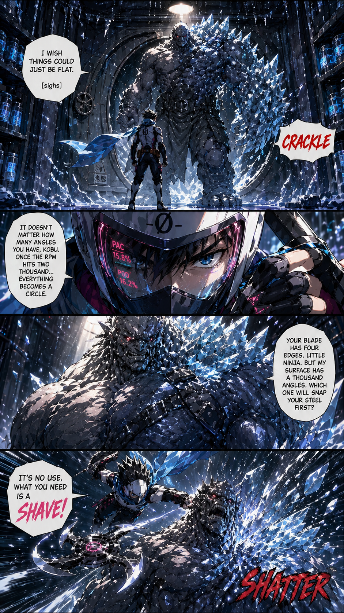

# 🎬 The Creami Stories: First Encounter

> In a world where the "Crystal Clan" has turned every dessert into a block of flavorless ice, one ninja stands between the world and a bad texture. **Kuri-0** is a rogue alchemist who mastered the "Forbidden Spin" to bring silkiness back to the people.
>
> But there is the great terror named **Kobu**, using the most dangerous weapon of all: **Uneven Expansion**. He is known as the "Blade-Breaker" because he is the only enemy Kuri-0 cannot simply spin through.
>
> They meet in "The Freezer" (Reitō-ko), a cold, silent purgatory where ingredients go to transform.

----
----

## PAGE ONE (4 Panels, portrait, 9:16)

**PANEL 1** **Setting:** *Kuri-0 stands in **The Freezer**, the single light flickering above him. The massive flapper door groans as **Kobu** (The Hump) steps through. Kobu’s jagged shoulder scrapes the ceiling, sending showers of ice crystals down.*

1.  Kuri-0: "I wish things could just be flat. [sighs]"
2.  Kobu: _CRACKLE_

**PANEL 2** **Close up** on Kuri's face. His eyes are tired, reflecting the dim light.

3.  **Kuri-0:** *(Reaches for the handle of the X-Processor)* "It doesn't matter how many angles you have, Kobu. Once the RPM hits two thousand... everything becomes a circle."

**PANEL 3** **Body shot** on Kobu. Bulging arms and breast, made of ice crystals.

4. **Kobu:** "Your blade has four edges, Little Ninja. But my surface has a thousand angles. Which one will snap your steel first?"

**PANEL 4** **Duel scene, wide angle** Kuri comes down on Kobu, blades swirling, ice crystals flying everywhere.

5. **Kuri:** "It's no use, what you need is a shave!"

6. **Kobu:** _SHATTER_
