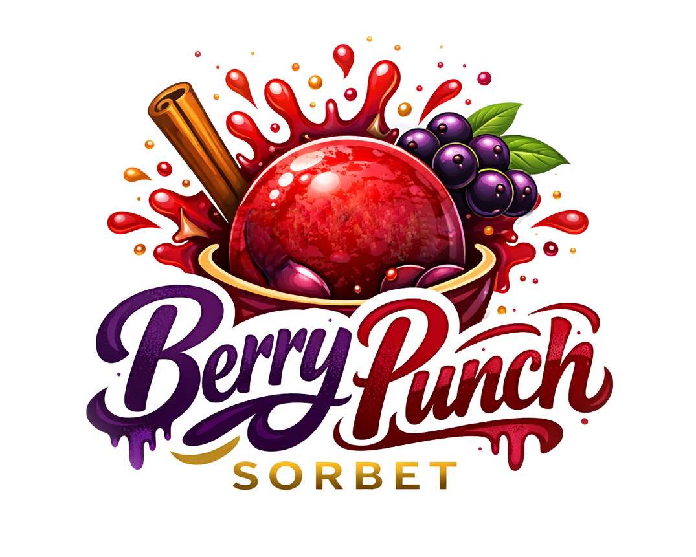

# Berry Punch (Deluxe)

Vibrant ruby-red sorbet from a 'Red Juice' mix, spiked with Scandic Bärgløgg for spiced berry warmth.

A bold & tangy flavor profile, with gløgg's clove-cinnamon notes.

> 🌿 **Vegan & Dairy-free**

Spin on “Sorbet”, scrape down, and re-mix.

> 
> 
> 

*Rating:* 😋🍇🍹 (untested)

# INGREDIENTS

ℹ️ Brand names are in square brackets `[...]`.

**Wet**

  - _300ml_ ‘Red Juice’ like Apple+Cherry+Prune [Aldi] • Grape, cherry, or some fruit mix
  - _170g_ Scandic Bärgløgg 11 vol% [Katlenburger] • 1 bottle = 750ml
  - _170ml_ Water (cold)

**Dry**

  - _20g_ [Inulin \[Vit4ever\]](/ice-creamery/info/ingredients/#inulin){target="_blank"}↗ • 2.9% of mix
  - _15g_ [Waxy Maize Starch (E1442) \[Ultratex\]](/ice-creamery/info/ingredients/#waxy-maize-starch-e1442){target="_blank"}↗ • 2.2% of mix
  - _3g_ [Gum Arabic (Acacia, E414) \[SaporePuro\]](/ice-creamery/info/ingredients/#acacia-gum-gum-arabic-e414){target="_blank"}↗ • 0.4% of mix
  - _1g_ Citric Acid • 0.5–1g ≈ 15ml lemon juice
  - _1g_ [Xanthan gum (E415, XG)](/ice-creamery/info/ingredients/#xanthan-gum-xg-e415){target="_blank"}↗ • 1tsp ≈ 2.8g
  - _10 pcs_ Sweetener Tablets [LightSüß] • 1 tablet ≃ 4g sugar

**Adjust sweetness**

  - _≈1 drops_ Flavor drops Strawberry (sucralose) [IronMaxx] • to taste

# DIRECTIONS

 1. Add "wet" ingredients to empty Creami tub.
 1. Weigh and mix dry ingredients, easiest by adding to a jar with a secure lid and shaking vigorously.
 1. Pour into the tub and *QUICKLY* use an immersion blender on full speed to homogenize everything.
 1. Let blender run until thickeners are properly hydrated, up to 1-2 min. Or blend again after waiting that time.
 1. Add remaining ingredients and stir with a spoon.
 1. For better results, let the base age in the fridge (covered, lid on), for a few hours or over night. This helps flavor development and gum hydration, especially with unheated bases.
 1. Freeze for 24h with lid on, then spin as usual. Flatten any humps before that.
 1. Process with RE-SPIN mode when not creamy enough after the first spin.

# NUTRITIONAL & OTHER INFO

- **Nutritional values per 100g/ml:** 100g; 66.9 kcal; fat 0.2g; carbs 10.1g; sugar 4.6g; protein 0.3g; salt 0.0g
- **Nutritional values per ½ Deluxe Tub:** 340g; 227.6 kcal; fat 0.8g; carbs 34.4g; sugar 15.8g; protein 0.9g; salt 0.1g
- **Nutritional values total:** 680g; 455.2 kcal; fat 1.5g; carbs 68.7g; sugar 31.6g; protein 1.7g; salt 0.2g
- **FPDF / [PAC](/ice-creamery/info/glossary/#potere-anti-congelante-pac){target="_blank"}↗ (target 20..30):** 30.63
- **Protein / Energy Ratio (ok=12%; hi=20%):** 1.51% • LOW-FAT • Low-Sugar • Low-Salt
- **Milk Solids Non-Fat ([MSNF](/ice-creamery/info/glossary/#milk-solids-not-fat-msnf){target="_blank"}↗, 7-11%):** 0.0g • 0.0%
- **Net carbs:** 50.9g • *∝ 5 servings@136g:* 10.2g • *∝ 3 servings@227g:* 17g • *energy ratio (low <20%):* 44.7%
