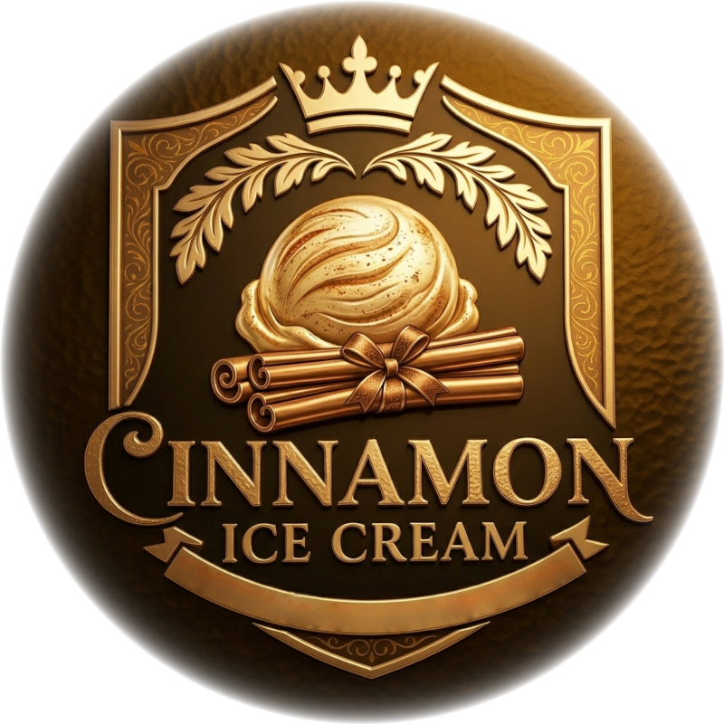

# Cinnamon (Deluxe)

A high-protein, low-sugar frozen treat designed for a creamy texture with reduced calories.

Spin on “Light Ice Cream”, scrape down, and re-mix if needed.

> 
> 
> 

Rating: 😋 (untested)



# INGREDIENTS

ℹ️ Brand names are in square brackets `[...]`.

**Wet**

  - _450ml_ [Soy milk 1.6% (sugar-free) \[Berief\]](/ice-creamery/info/ingredients/#soy-milk){target="_blank"}↗ (≈1 cup + 7 fl oz) • *alternative:* any other preferred milk (~2% fat) <a id="id-2755284" href="https://jhermann.github.io/ice-creamery/info/nutrition/#id-2755284">ℹ️</a>
  - _100g_ [Cottage Cheese 4% \[REWE Bio\]](/ice-creamery/info/ingredients/#cottage-cheese){target="_blank"}↗ (≈3 oz + 1 tbsp) • *alternative:* 30g cream cheese and 70ml milk <a id="id-c6c5c25" href="https://jhermann.github.io/ice-creamery/info/nutrition/#id-c6c5c25">ℹ️</a>
  - _15g_ [Glycerin (E422, VG) \[hd-line\]](/ice-creamery/info/ingredients/#vegetable-glycerin-glycerol-vg-e422){target="_blank"}↗ (≈1 tbsp) <a id="id-8717e6d" href="https://jhermann.github.io/ice-creamery/info/nutrition/#id-8717e6d">ℹ️</a>
  - _10g_ [Brandy or Vodka 40 vol%](/ice-creamery/info/ingredients/#alcohol-ethanol){target="_blank"}↗ (≈2 tsp) • *alternative:* 8g (additional) VG for a sober recipe <a id="id-63b8bf1" href="https://jhermann.github.io/ice-creamery/info/nutrition/#id-63b8bf1">ℹ️</a>

**Dry**

  - _40g_ [SweEX (Erythritol + Xylitol 3:2)](/ice-creamery/info/ingredients/#sweex-erythritol-xylitol-blend){target="_blank"}↗ (≈1 oz + 2 ¼ tsp) • *alternative:* 53g allulose or dextrose <a id="id-f44b101" href="https://jhermann.github.io/ice-creamery/info/nutrition/#id-f44b101">ℹ️</a>
  - _15g_ [Whey + Casein protein (grass-fed) \[Vilgain\]](/ice-creamery/info/ingredients/#whey-protein){target="_blank"}↗ (≈1 tbsp) • with stevia <a id="id-b954be3" href="https://jhermann.github.io/ice-creamery/info/nutrition/#id-b954be3">ℹ️</a>
  - _10g_ [Waxy Maize Starch (E1442) \[Ultratex\]](/ice-creamery/info/ingredients/#waxy-maize-starch-e1442){target="_blank"}↗ (≈2 tsp) • *alternative:* [E1422](https://jhermann.github.io/ice-creamery/info/ingredients/#acetylated-distarch-adipate-e1422), or any instant starch <a id="id-0e5caff" href="https://jhermann.github.io/ice-creamery/info/nutrition/#id-0e5caff">ℹ️</a>
  - _4g_ Cinnamon (Ceylon) (≈1.3 tsp) • to taste; 1tsp = 3g
  - _1g_ Salt (≈¼ tsp)

**Fill to MAX**

  - _35ml_ Cream 32% [REWE Beste Wahl] (≈1 fl oz + 1 tsp) <a id="id-92fa780" href="https://jhermann.github.io/ice-creamery/info/nutrition/#id-92fa780">ℹ️</a>
  - _≈3 drops_ Flavor drops Vanilla (sucralose) [IronMaxx] • to taste

# DIRECTIONS

 1. Add "wet" ingredients to empty Creami tub.
 1. Weigh and mix dry ingredients, easiest by adding to a jar with a secure lid and shaking vigorously.
 1. Pour into the tub and *QUICKLY* use an immersion blender on full speed to homogenize everything.
 1. Let blender run until thickeners are properly hydrated, up to 1-2 min. Or blend again after waiting that time.
 1. Add remaining ingredients (to the MAX line) and stir with a spoon.
 1. For better results, let the base age in the fridge (covered, lid on), for a few hours or over night. This helps flavor development and gum hydration, especially with unheated bases.
 1. Freeze for 24h with lid on, then spin as usual. Flatten any humps before that.
 1. Process with RE-SPIN mode when not creamy enough after the first spin.

# NUTRITIONAL & OTHER INFO

| 🥗 Value | 100g | Serving | Total |
| :--- | ---: | ---: | ---: |
| ⚖️ Weight (g) | 100 | 340 | 680 |
| 🔥 Energy (kcal) | 82.9 | 281.7 | 563.4 |
| 🫒 Fat (g) | 3.4 | 11.6 | 23.1 |
| 🍞 Carbohydrates (g) | 10.5 | 35.8 | 71.6 |
| 🍬 Sugars (g) | 0.4 | 1.5 | 3.0 |
| 💪 Protein (g) | 5.8 | 19.6 | 39.1 |
| 🧂 Salt (g) | 0.3 | 1.1 | 2.2 |

- **FPDF / [PAC](/ice-creamery/info/glossary/#potere-anti-congelante-pac){target="_blank"}↗ (target 20..30):** 30.80
- **Protein / Energy Ratio (ok=12%; hi=20%):** 27.78% • Low-Sugar • Hi-Protein
- **Milk Solids Non-Fat ([MSNF](/ice-creamery/info/glossary/#milk-solids-not-fat-msnf){target="_blank"}↗, 7-11%):** 49.8g • 7.3%
- **Net carbs:** 24.1g • *∝ 5 servings@136g:* 4.8g • *∝ 3 servings@227g:* 8g • *energy ratio (low <20%):* 17.1%
