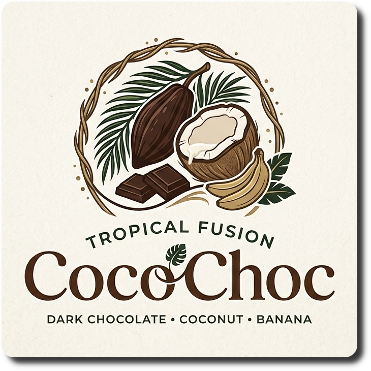
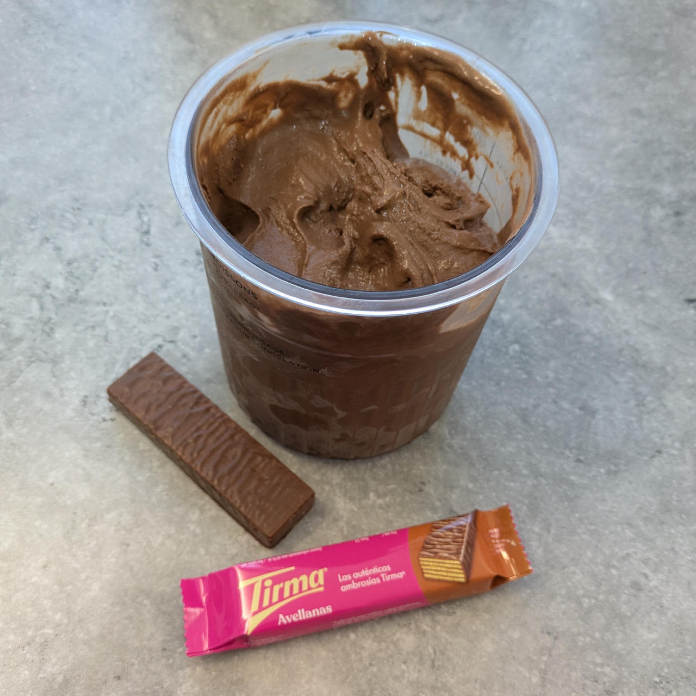
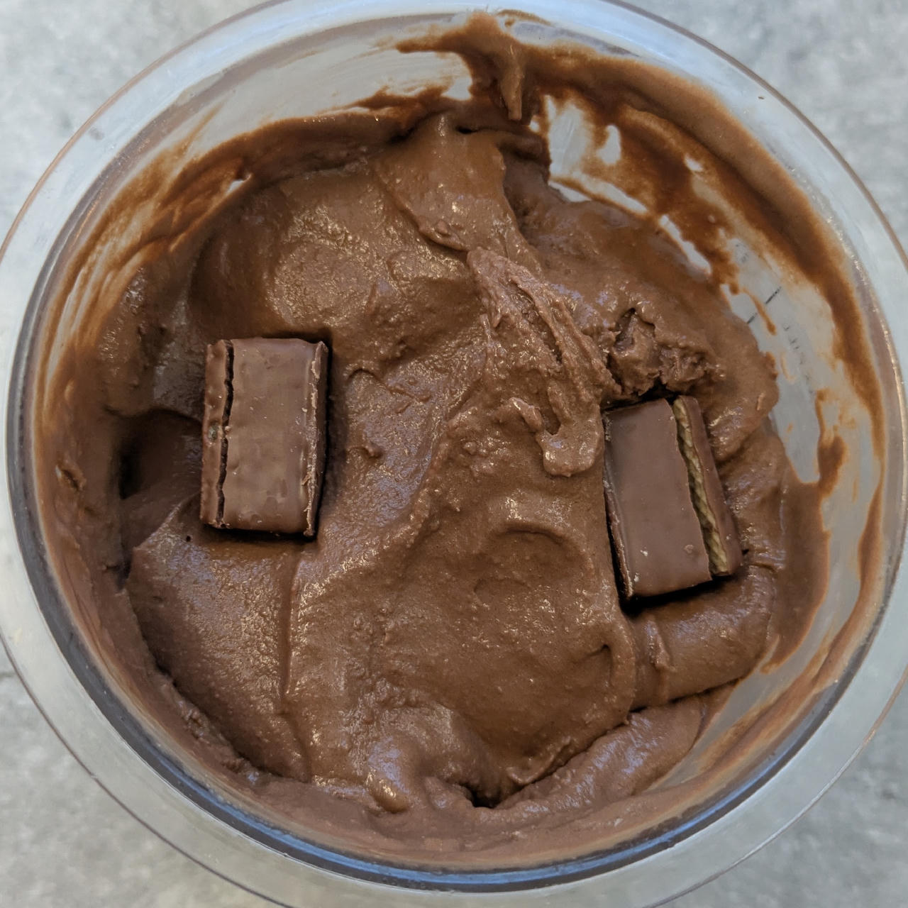
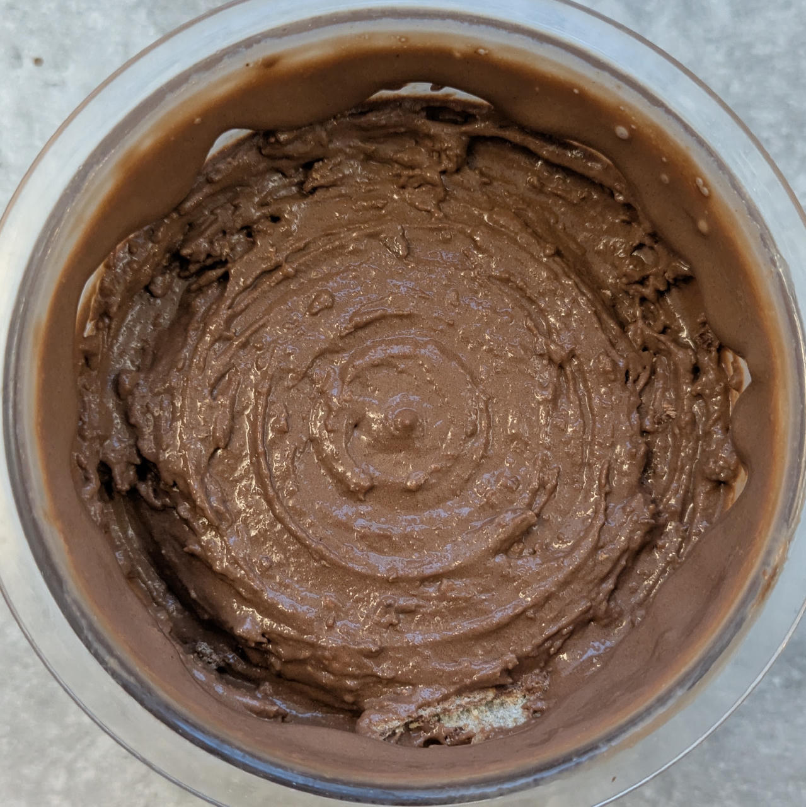

# CocoChoc (Deluxe)

*CocoChoc* is a rich, tropical fusion where deep cocoa and dark chocolate meet the velvety smoothness of coconut.

> 🌿 **Vegan & Dairy-free**

The 100g of banana acts as a natural binder, providing a thick, fudgy body without overwhelming the chocolate profile.

Process on *Light Ice Cream*, do a scrape-down, and MIX-IN or RESPIN
(choose depending on consistency you get after processing, and eventually want after 2nd spin).

> 
> 
> 

*Rating:* 😋🥥🍫 (untested)

# INGREDIENTS

ℹ️ Brand names are in square brackets `[...]`.

**Prep**

  - _200ml_ [Soy milk 1.6% (sugar-free) \[Berief\]](/ice-creamery/info/ingredients/#soy-milk){target="_blank"}↗ (≈6 fl oz + 1 tbsp + 1 ½ tsp) • use any other preferred milk (~2% fat) <a id="id-2755284" href="https://jhermann.github.io/ice-creamery/info/nutrition/#id-2755284">ℹ️</a>
  - _35g_ [Coconut Milk Powder 54% \[Green Essence\]](/ice-creamery/info/ingredients/#coconut-milk){target="_blank"}↗ (≈1 oz + 1 ¼ tsp) • *alternative:* 80ml coconut milk 22%, 50ml less soy milk <a id="id-e0c6e86" href="https://jhermann.github.io/ice-creamery/info/nutrition/#id-e0c6e86">ℹ️</a>
  - _30g_ [Cocoa Powder Organic 11% \[Sevenhills\]](/ice-creamery/info/ingredients/#cocoa-powder){target="_blank"}↗ (≈2 tbsp)
  - _25g_ Dark chocolate 85% [Moser-Roth/Aldi] (≈1 tbsp + 2 tsp) • Portion = 25g

**Wet**

  - _100g_ Bananas (ripe, peeled) (≈3 oz + 1 tbsp) • 1 medium sized piece <a id="id-5638add" href="https://jhermann.github.io/ice-creamery/info/nutrition/#id-5638add">ℹ️</a>
  - _20g_ [Glycerin (E422, VG) \[hd-line\]](/ice-creamery/info/ingredients/#vegetable-glycerin-glycerol-vg-e422){target="_blank"}↗ (≈1 tbsp + 1 tsp) • Sweetness = 60%; GI = 5; Density = 1.26 g/ml <a id="id-8717e6d" href="https://jhermann.github.io/ice-creamery/info/nutrition/#id-8717e6d">ℹ️</a>
  - _15g_ [Brandy or Vodka 40 vol%](/ice-creamery/info/ingredients/#alcohol-ethanol){target="_blank"}↗ (≈1 tbsp) • *alternative:* 12g (additional) VG for a sober recipe <a id="id-63b8bf1" href="https://jhermann.github.io/ice-creamery/info/nutrition/#id-63b8bf1">ℹ️</a>
  - _200ml_ [Soy milk 1.6% (sugar-free) \[Berief\]](/ice-creamery/info/ingredients/#soy-milk){target="_blank"}↗ (≈6 fl oz + 1 tbsp + 1 ½ tsp) • use any other preferred milk (~2% fat) <a id="id-2755284" href="https://jhermann.github.io/ice-creamery/info/nutrition/#id-2755284">ℹ️</a>

**Dry**

  - _40g_ [SweEX (Erythritol + Xylitol 3:2)](/ice-creamery/info/ingredients/#sweex-erythritol-xylitol-blend){target="_blank"}↗ (≈1 oz + 2 ¼ tsp) • *alternative:* 53g allulose or dextrose <a id="id-f44b101" href="https://jhermann.github.io/ice-creamery/info/nutrition/#id-f44b101">ℹ️</a>
  - _10g_ [Salty Stability \[Inulin / GMS / CMC / Guar / XG / Salt\]](/ice-creamery/S/Salty%20Stability/){target="_blank"}↗ (≈2 tsp) • *not-as-good substitute:* 1g guar, 0.3g xanthan, and 0.3g salt <a id="id-3d1ecef" href="https://jhermann.github.io/ice-creamery/info/nutrition/#id-3d1ecef">ℹ️</a>
  - _3g_ Instant Coffee [Mount Hagen] (≈½ tsp) • 1.5g per 125ml <a id="id-b954be3" href="https://jhermann.github.io/ice-creamery/info/nutrition/#id-b954be3">ℹ️</a>

**Adjust sweetness**

  - _≈6 drops_ Flavor drops Vanilla (sucralose) [IronMaxx] • to taste

# DIRECTIONS

 1. Mix the cocoa and coconut milk powder with milk heatened in the microwave (to >80°C), blend to a smooth paste.
 1. Melt the chocolate into the still warm paste.
 1. Blend the banana and other wet ingredients except the soy milk in an empty Creami tub, to a smooth consistency.
 1. Add the bloomed cocoa paste and the 2nd part of the soy milk, and blend to integrate.
 1. Weigh and mix dry ingredients, easiest by adding to a jar with a secure lid and shaking vigorously.
 1. Pour into the tub and *QUICKLY* use an immersion blender on full speed to homogenize everything.
 1. Let blender run until thickeners are properly hydrated, up to 1-2 min. Or blend again after waiting that time.
 1. Add remaining ingredients and stir with a spoon.
 1. For better results, let the base age in the fridge (covered, lid on), for a few hours or over night. This helps flavor development and gum hydration, especially with unheated bases.
 1. Freeze for 24h with lid on, then spin as usual. Flatten any humps before that.
 1. Process with RE-SPIN mode when not creamy enough after the first spin.

# NUTRITIONAL & OTHER INFO

| 🥗 Value | 100g | Serving | Total |
| :--- | ---: | ---: | ---: |
| ⚖️ Weight (g) | 100 | 340 | 678 |
| 🔥 Energy (kcal) | 133.6 | 454.2 | 905.7 |
| 🫒 Fat (g) | 6.3 | 21.3 | 42.4 |
| 🍞 Carbohydrates (g) | 17.8 | 60.6 | 120.9 |
| 🍬 Sugars (g) | 3.1 | 10.4 | 20.8 |
| 💪 Protein (g) | 3.9 | 13.3 | 26.6 |
| 🧂 Salt (g) | 0.1 | 0.4 | 0.8 |

- **FPDF / [PAC](/ice-creamery/info/glossary/#potere-anti-congelante-pac){target="_blank"}↗ (target 20..30):** 30.60
- **Protein / Energy Ratio (ok=12%; hi=20%):** 11.74% • Low-Sugar
- **Milk Solids Non-Fat ([MSNF](/ice-creamery/info/glossary/#milk-solids-not-fat-msnf){target="_blank"}↗, 7-11%):** 32.3g • 4.8%
- **Net carbs:** 63.5g • *∝ 5 servings@136g:* 12.7g • *∝ 3 servings@226g:* 21.2g • *energy ratio (low <20%):* 28%
- **10g 'Salty Stability' is:** 7.3g Inulin • 1.2g Glycerol Monostearate (GMS / E471) • 0.6g Tylose powder (E466, Tylo, CMC) • 0.4g Guar gum (E412) • 0.33g Salt • 0.13g Xanthan gum (E415, XG).
