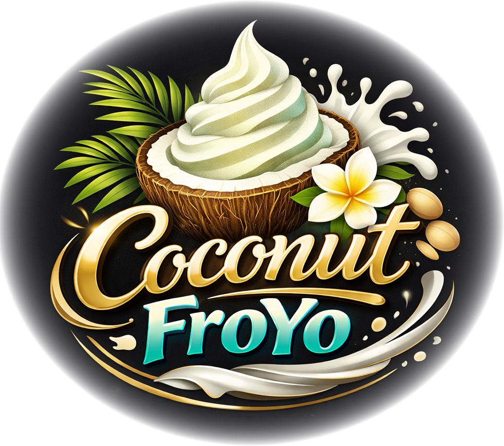
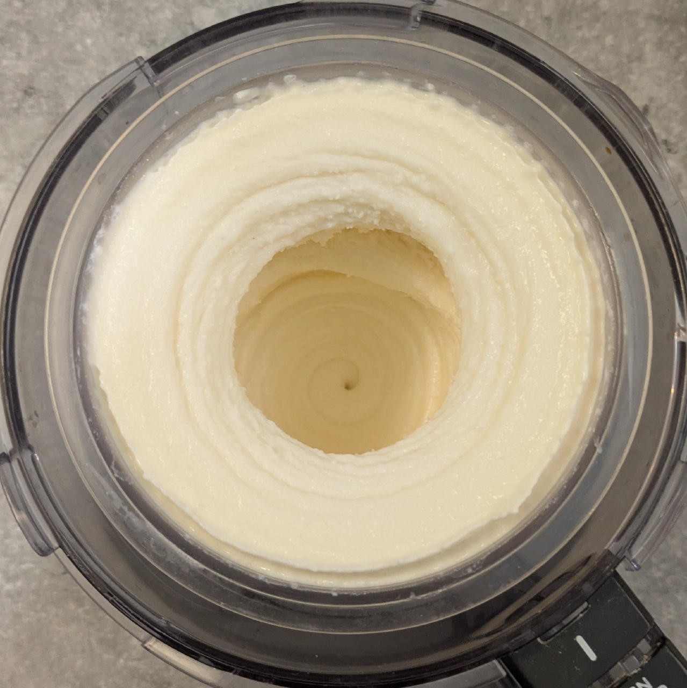
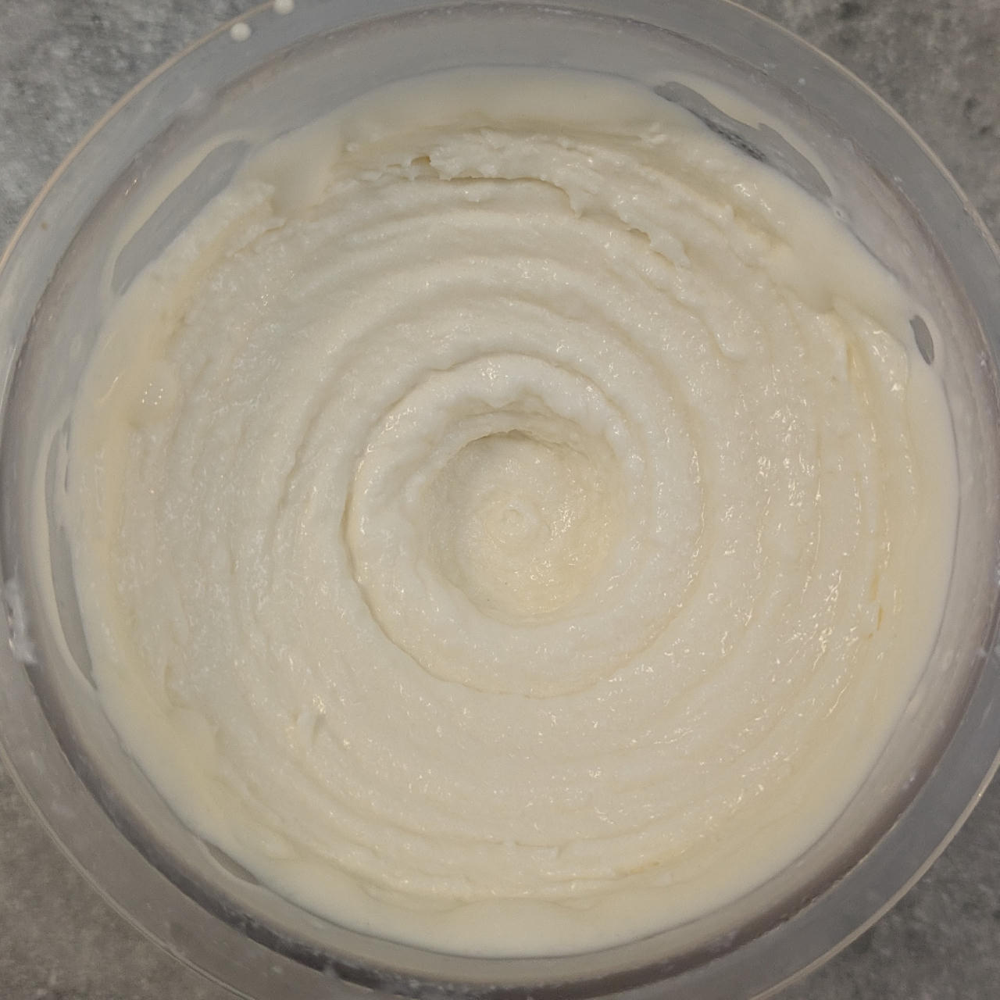
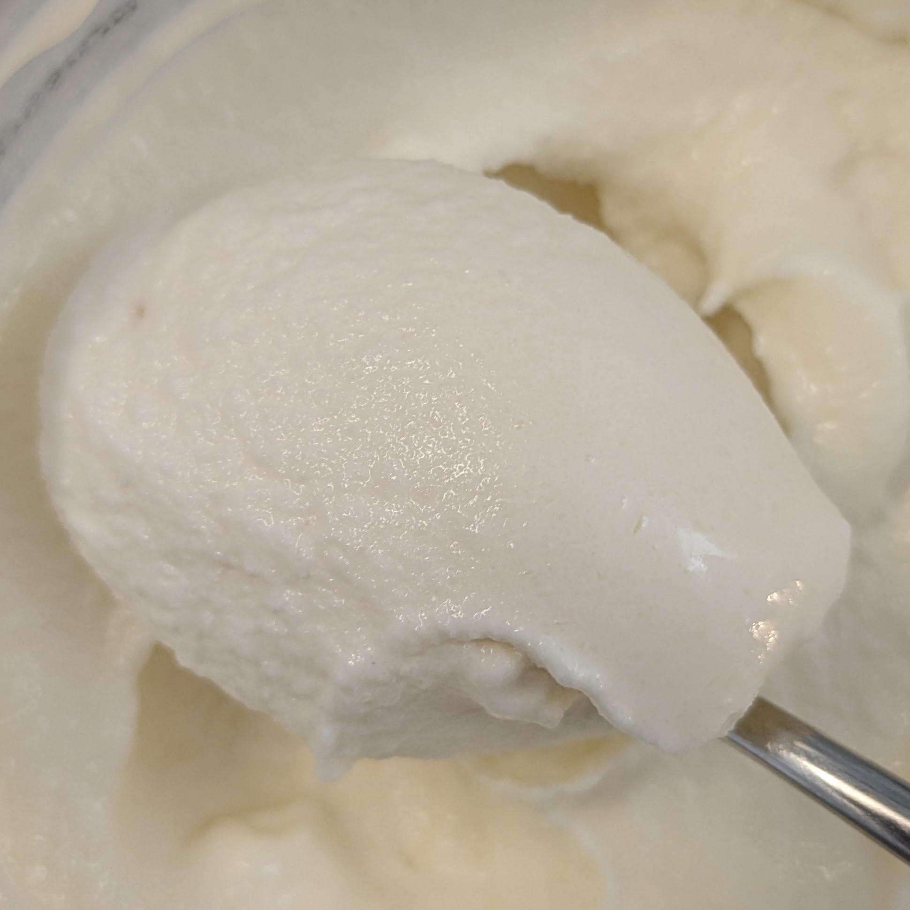

# Coconut FroYo (Deluxe)

Tangy yogurt ice cream with coconut flavor.

Process on *Light Ice Cream*, do a scrape-down, and finish with MIX-IN.

> 
> 
> 

Rating: 😋🐮🥛🥛🥥 (creamy, with subtle coconut flavor)

# INGREDIENTS

ℹ️ Brand names are in square brackets `[...]`.

**Wet**

  - _400ml_ Yogurt mild 4% [REWE Bio] • 500g container; can be lower fat (2% or ‘zero’), or buttermilk
  - _150ml_ [Soy milk 1.6% (sugar-free) \[Berief\]](/ice-creamery/info/ingredients/#soy-milk){target="_blank"}↗ • use any other preferred milk (~2% fat)
  - _10g_ [Brandy or Vodka 40 vol%](/ice-creamery/info/ingredients/#alcohol-ethanol){target="_blank"}↗ • *alternative:* 8g (additional) VG for a sober recipe
  - _10g_ [Glycerin (E422, VG) \[hd-line\]](/ice-creamery/info/ingredients/#vegetable-glycerin-glycerol-vg-e422){target="_blank"}↗ • Sweetness = 60%; GI = 5; Density = 1.26 g/ml

**Dry**

  - _55g_ [Coconut Milk Powder 54% \[Green Essence\]](/ice-creamery/info/ingredients/#coconut-milk){target="_blank"}↗ • *alternative:* 200ml coconut milk 18–22%, and skip the soy milk
  - _40g_ [SweEX (Erythritol + Xylitol 3:2)](/ice-creamery/info/ingredients/#sweex-erythritol-xylitol-blend){target="_blank"}↗ • *alternative:* 53g allulose or dextrose
  - _20g_ [Inulin \[Vit4ever\]](/ice-creamery/info/ingredients/#inulin){target="_blank"}↗ • Sweetness = 8%; GI ~= 0
  - _3g_ [Glycerol Monostearate (E471) \[Bulk\]](/ice-creamery/info/ingredients/#glycerol-monostearate-gms-e471){target="_blank"}↗ • *alternative:* lecithin, or 0.5g xanthan
  - _1g_ [Carboxymethyl Cellulose (CMC / E466) \[GoodBake\]](/ice-creamery/info/ingredients/#carboxymethyl-cellulose-cmc-e466){target="_blank"}↗
  - _1g_ Salt

**Adjust sweetness**

  - _≈3 drops_ Flavor drops Vanilla (sucralose) [IronMaxx] • to taste

# DIRECTIONS

 1. Microwave the ‘wet’ ingredients to about 60°C in the Creami tub.
 1. Weigh and mix dry ingredients, easiest by adding to a jar with a secure lid and shaking vigorously.
 1. Pour into the tub and *QUICKLY* use an immersion blender on full speed to homogenize everything.
 1. Let blender run until thickeners are properly hydrated, up to 1-2 min. Or blend again after waiting that time.
 1. Add remaining ingredients (to the MAX line) and stir with a spoon.
 1. For better results, let the base age in the fridge (covered, lid on), for a few hours or over night. This helps flavor development and gum hydration, especially with unheated bases.
 1. Freeze for 24h with lid on, then spin as usual. Flatten any humps before that.
 1. Process with RE-SPIN mode when not creamy enough after the first spin.

# NUTRITIONAL & OTHER INFO

- **Nutritional values per 100g/ml:** 100g; 123.7 kcal; fat 6.9g; carbs 16.5g; sugar 3.2g; protein 3.5g; salt 0.3g
- **Nutritional values per ½ Deluxe Tub:** 340g; 420.5 kcal; fat 23.6g; carbs 55.9g; sugar 11.0g; protein 12.0g; salt 0.9g
- **Nutritional values total:** 690g; 853.3 kcal; fat 47.9g; carbs 113.5g; sugar 22.3g; protein 24.3g; salt 1.8g
- **FPDF / [PAC](/ice-creamery/info/glossary/#potere-anti-congelante-pac){target="_blank"}↗ (target 20..30):** 30.07
- **Protein / Energy Ratio (ok=12%; hi=20%):** 11.41% • Low-Sugar
- **Milk Solids Non-Fat ([MSNF](/ice-creamery/info/glossary/#milk-solids-not-fat-msnf){target="_blank"}↗, 7-11%):** 72.6g • 10.5%
- **Net carbs:** 50.7g • *∝ 5 servings@138g:* 10.1g • *∝ 3 servings@230g:* 16.9g • *energy ratio (low <20%):* 23.8%
