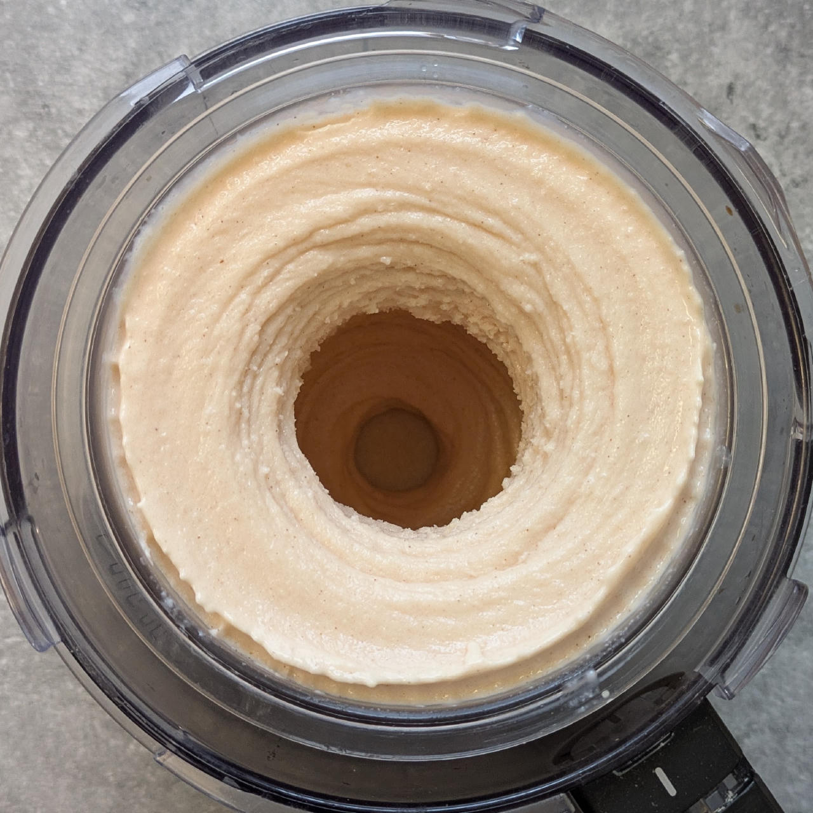
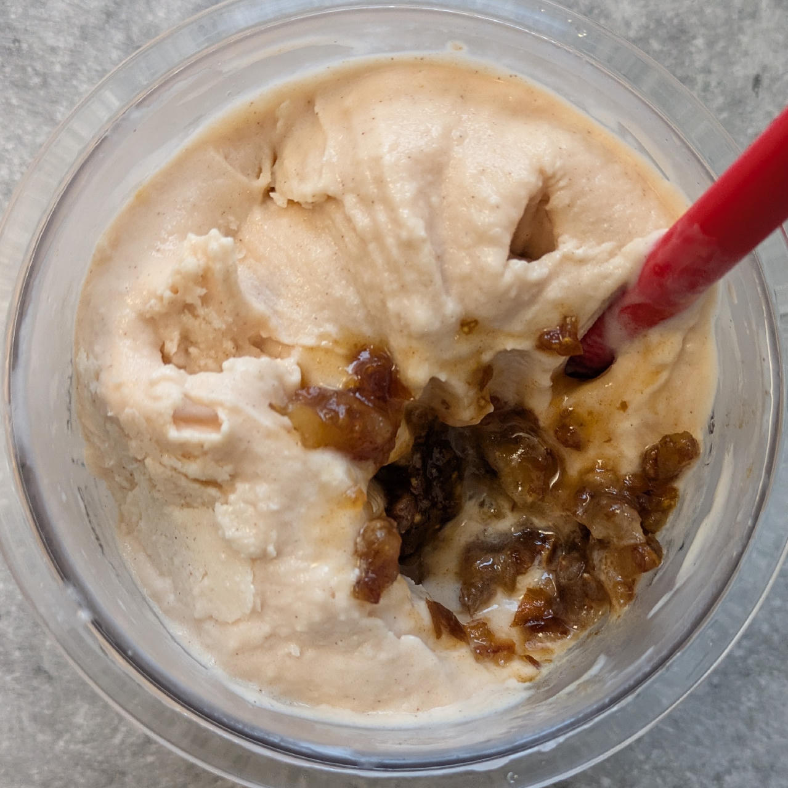
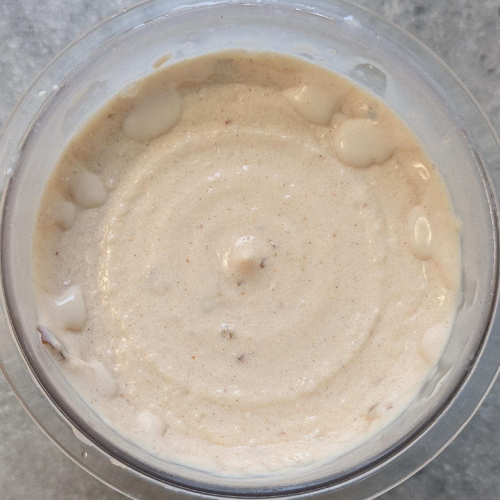
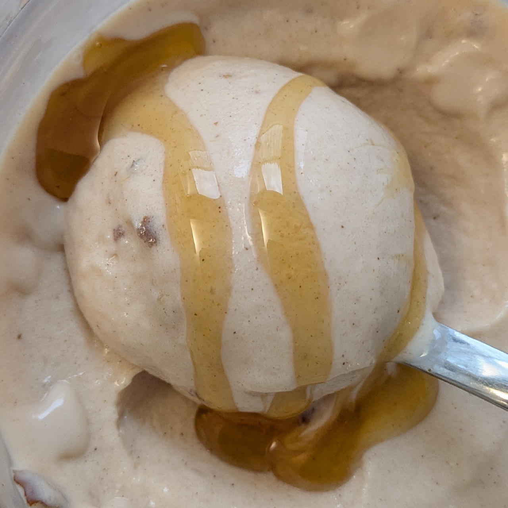

# Crème Caramel (Deluxe)

Not the traditional recipe, but a lighter version using
thickened dairy products instead of eggs and milk.

> 

Spin on *Light Ice Cream*, do a scrape-down, and finish with a mix-in or respin run.

> 
> 
> 
> 

Rating: 😋🍮🥛🍮🥛 (creamy, a bit too sweet, nice and strong caramel flavor)

# INGREDIENTS

ℹ️ Brand names are in square brackets `[...]`.

**Wet**

  - _300ml_ [Soy milk 1.6% (sugar-free) \[Berief\]](/ice-creamery/info/ingredients/#soy-milk){target="_blank"}↗ • *alternative:* any other preferred milk (~2% fat)
  - _240g_ [Topfen / Quark 0.6% \[Berchtesgadener\]](/ice-creamery/info/ingredients/#quark-topfen){target="_blank"}↗ • 250g container; *US alternative:* low-fat cream cheese
  - _50ml_ Syrup Caramel (low-sugar) [Sukrin] • 14% sorbitol, erythritol, stevia [75kcal, 0.9g sugar]
  - _20g_ [Glycerin (E422, VG) \[hd-line\]](/ice-creamery/info/ingredients/#vegetable-glycerin-glycerol-vg-e422){target="_blank"}↗ • POD = 60%; GI = 5; Density = 1.26 g/ml

**Dry**

  - _45g_ [SweEX (Erythritol + Xylitol 3:2)](/ice-creamery/info/ingredients/#sweex-erythritol-xylitol-blend){target="_blank"}↗ • *alternative:* 60g allulose or dextrose
  - _15g_ [Inulin \[Vit4ever\]](/ice-creamery/info/ingredients/#inulin){target="_blank"}↗ • Sweetness = 8%; GI ~= 0
  - _5g_ [Waxy Maize Starch (E1442) \[Ultratex\]](/ice-creamery/info/ingredients/#waxy-maize-starch-e1442){target="_blank"}↗ • *alternative:* [E1422](https://jhermann.github.io/ice-creamery/info/ingredients/#acetylated-distarch-adipate-e1422), or any instant starch
  - _1g_ Salt

**Fill to MAX**

  - _≈3 drops_ Flavor drops Caramel (sucralose) [IronMaxx] • to taste
  - _≈1 drops_ Flavor drops Vanilla (sucralose) [IronMaxx] • to taste

**Mix-ins**

  - _40g_ Medjool dates (organic) [Seba Garden] • 1 date = 20g; pitted, possibly soaked, and chopped [111kcal, 26.4g sugar]

**Topping Options**

  - _10ml_ Syrup Caramel (low-sugar) [Sukrin] • 14% sorbitol, erythritol, stevia [15kcal, 0.2g sugar]

# DIRECTIONS

 1. Add "wet" ingredients to empty Creami tub.
 1. Weigh and mix dry ingredients, easiest by adding to a jar with a secure lid and shaking vigorously.
 1. Pour into the tub and *QUICKLY* use an immersion blender on full speed to homogenize everything.
 1. Let blender run until thickeners are properly hydrated, up to 1-2 min. Or blend again after waiting that time.
 1. Add remaining ingredients (to the MAX line) and stir with a spoon.
 1. For better results, let the base age in the fridge (covered, lid on), for a few hours or over night. This helps flavor development and gum hydration, especially with unheated bases.
 1. Freeze for 24h with lid on, then spin as usual. Flatten any humps before that.
 1. Process with RE-SPIN mode when not creamy enough after the first spin.
 1. Process with MIX-IN after adding mix-ins evenly. For that, add partial amounts into a hole going down to the bottom, and fold the ice cream over, building pockets of mix-ins.

# NUTRITIONAL & OTHER INFO

- **Nutritional values per 100g/ml:** 100g; 75.9 kcal; fat 0.9g; carbs 15.7g; sugar 1.6g; protein 5.6g; salt 0.2g
- **Nutritional values per ½ Deluxe Tub:** 340g; 258.0 kcal; fat 3.1g; carbs 53.3g; sugar 5.4g; protein 18.9g; salt 0.8g
- **Nutritional values total:** 676g; 512.9 kcal; fat 6.2g; carbs 106.0g; sugar 10.7g; protein 37.6g; salt 1.5g
- **FPDF / [PAC](/ice-creamery/info/glossary/#potere-anti-congelante-pac){target="_blank"}↗ (target 20..30):** 31.67
- **Protein / Energy Ratio (ok=12%; hi=20%):** 29.31% • LOW-FAT • Low-Sugar • Hi-Protein
- **Milk Solids Non-Fat ([MSNF](/ice-creamery/info/glossary/#milk-solids-not-fat-msnf){target="_blank"}↗, 7-11%):** 39.4g • 5.8%
- **Net carbs:** 32.7g • *∝ 5 servings@135g:* 6.5g • *∝ 3 servings@225g:* 10.9g • *energy ratio (low <20%):* 25.5%
