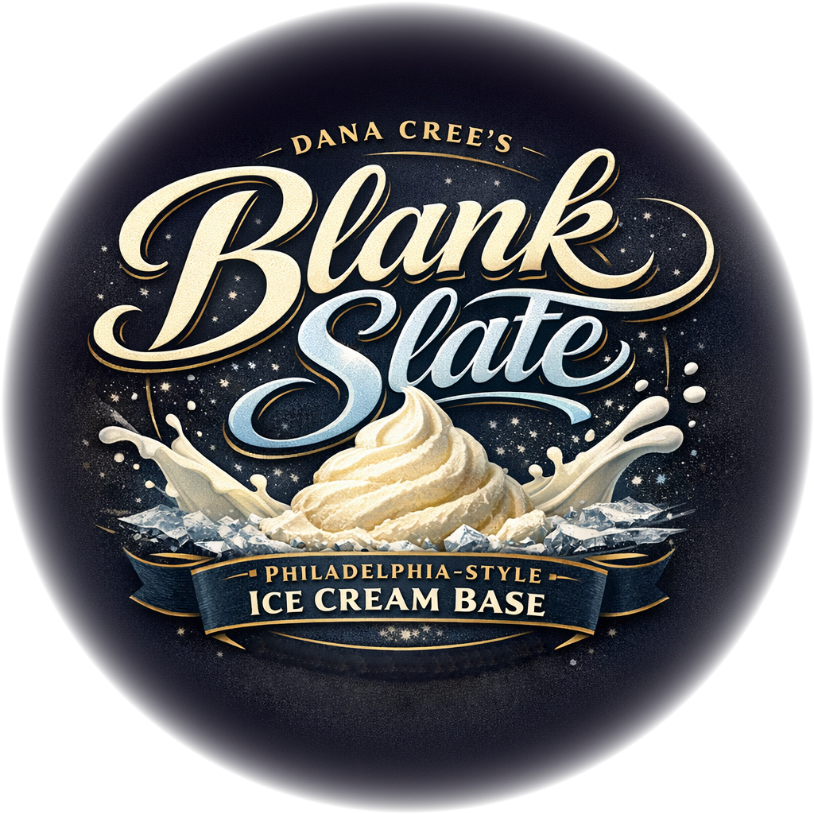

# DC's Blank Slate (Deluxe)

Dana Cree’s “Blank Slate” Philadelphia-style base, scaled to ~625g.

Spin on “Ice Cream”, scrape down, and re-mix if needed.

> 
> 
> 

Rating: 😋 (untested)

!!! info "Simple Recipe"

    Read [About 'Simple' Recipes](/ice-creamery/info/tips%2Btricks/#about-simple-recipes)    regarding 'exotic' ingredients and their alternatives.

# INGREDIENTS

ℹ️ Brand names are in square brackets `[...]`.

**Prep**

  - _15ml_ Water (cold)
  - _6g_ Corn starch

**Wet**

  - _240ml_ Milk 3.5% [Weihenstephan]
  - _230ml_ Cream 32% [REWE Beste Wahl]
  - _30ml_ Light corn syrup (32 DE) [Karo] • US brand; *alternative:* rice, agave, or maple syrup

**Dry**

  - _90g_ Sugar
  - _15g_ [Milk powder 1:10 (skim, SMP) \[Vita2You\]](/ice-creamery/info/ingredients/#skim-milk-powder-smp){target="_blank"}↗
  - _1g_ Salt

# DIRECTIONS

 1. Mix the dry ingredients in a small container.
 1. Bring cream, milk, and syrup to a full rolling boil while whisking.
 1. Whisk in the dry mix, simmer 2 minutes while whisking.
 1. Mix cornstarch and water to a smooth slurry, and whisk that into the base, cook 1 minute more.
 1. Chill quickly, in an ice bath.
 1. For better results, let the base age in the fridge (covered, lid on), for a few hours or over night. This helps flavor development and gum hydration, especially with unheated bases.
 1. Freeze for 24h with lid on, then spin as usual. Flatten any humps before that.
 1. Process with RE-SPIN mode when not creamy enough after the first spin.

# NUTRITIONAL & OTHER INFO

- **Nutritional values per 100g/ml:** 100g; 225.2 kcal; fat 13.1g; carbs 24.1g; sugar 20.1g; protein 3.1g; salt 0.3g
- **Nutritional values per ½ Deluxe Tub:** 340g; 765.7 kcal; fat 44.6g; carbs 82.1g; sugar 68.4g; protein 10.5g; salt 1.0g
- **Nutritional values total:** 627g; 1412.1 kcal; fat 82.2g; carbs 151.4g; sugar 126.1g; protein 19.4g; salt 1.8g
- **FPDF / [PAC](/ice-creamery/info/glossary/#potere-anti-congelante-pac){target="_blank"}↗ (target 20..30):** 24.12
- **Protein / Energy Ratio (ok=12%; hi=20%):** 5.50%
- **Milk Solids Non-Fat ([MSNF](/ice-creamery/info/glossary/#milk-solids-not-fat-msnf){target="_blank"}↗, 7-11%):** 50.2g • 8.0%
- **Net carbs:** 151.4g • *∝ 5 servings@125g:* 30.3g • *∝ 3 servings@209g:* 50.5g • *energy ratio (low <20%):* 42.9%
