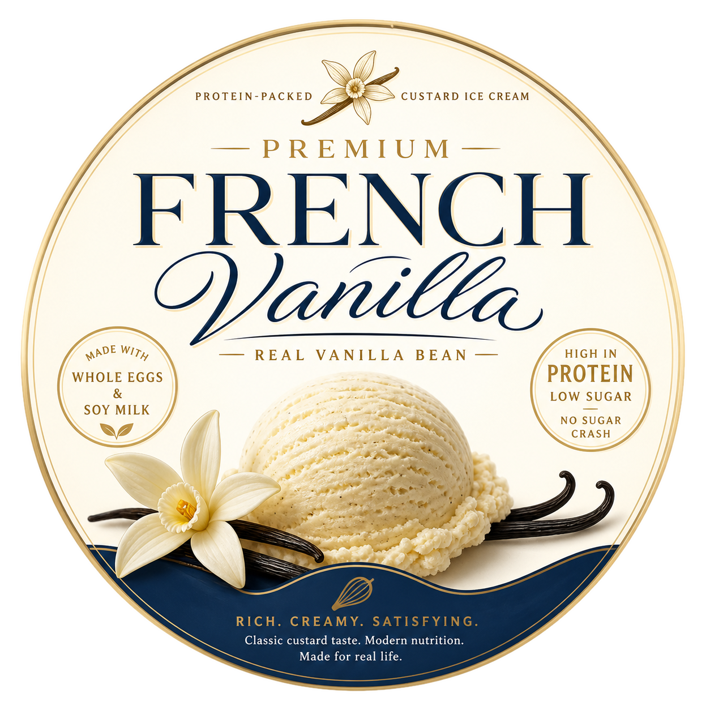

# French Vanilla (Deluxe)

This is a thick, custard-style vanilla ice cream made with whole eggs and soy milk, to creates a rich, traditional base
that is much higher in protein than standard pints. Because it uses sugar-free sweeteners and plant fibers, it gives you
the creamy satisfaction of a classic custard without the heavy sugar crash.

The flavor is focused on real vanilla bean. It’s a perfect match for someone
who wants a filling, protein-packed dessert with a professional, silky finish.

Spin on “Light Ice Cream”, scrape down, and re-mix if needed.
> 
> 
> 

Rating: 😋🥛🥚 (untested)

# INGREDIENTS

ℹ️ Brand names are in square brackets `[...]`.

**Prep**

  - _350ml_ [Soy milk 1.6% (sugar-free) \[Berief\]](/ice-creamery/info/ingredients/#soy-milk){target="_blank"}↗ (≈1 cup + 3 fl oz + 1 tbsp) • *alternative:* any other preferred milk (~2% fat) <a id="id-2755284" href="https://jhermann.github.io/ice-creamery/info/nutrition/#id-2755284">ℹ️</a>
  - _175g_ Eggs (≈6 oz) • 1 medium egg 55–60g <a id="id-2d52658" href="https://jhermann.github.io/ice-creamery/info/nutrition/#id-2d52658">ℹ️</a>

**Wet**

  - _15g_ [Brandy or Vodka 40 vol%](/ice-creamery/info/ingredients/#alcohol-ethanol){target="_blank"}↗ (≈1 tbsp) • *alternative:* same amount additional VG for a sober recipe <a id="id-63b8bf1" href="https://jhermann.github.io/ice-creamery/info/nutrition/#id-63b8bf1">ℹ️</a>
  - _10g_ [Glycerin (E422, VG) \[hd-line\]](/ice-creamery/info/ingredients/#vegetable-glycerin-glycerol-vg-e422){target="_blank"}↗ (≈2 tsp) • *alternative:* 8g (additional) VG for a sober recipe <a id="id-8717e6d" href="https://jhermann.github.io/ice-creamery/info/nutrition/#id-8717e6d">ℹ️</a>
  - _5ml_ Vanilla Extract (w/ alcohol) [Native Vanilla] (≈1 tsp) <a id="id-92d1980" href="https://jhermann.github.io/ice-creamery/info/nutrition/#id-92d1980">ℹ️</a>

**Dry**

  - _50g_ [Milk powder 1:10 (skim, SMP) \[Vita2You\]](/ice-creamery/info/ingredients/#skim-milk-powder-smp){target="_blank"}↗ (≈1 oz + 1 tbsp + 1 ½ tsp) <a id="id-074ed6d" href="https://jhermann.github.io/ice-creamery/info/nutrition/#id-074ed6d">ℹ️</a>
  - _30g_ [SweEX (Erythritol + Xylitol 3:2)](/ice-creamery/info/ingredients/#sweex-erythritol-xylitol-blend){target="_blank"}↗ (≈2 tbsp) • *alternative:* 40g allulose or dextrose <a id="id-f44b101" href="https://jhermann.github.io/ice-creamery/info/nutrition/#id-f44b101">ℹ️</a>
  - _15g_ [Inulin \[Vit4ever\]](/ice-creamery/info/ingredients/#inulin){target="_blank"}↗ (≈1 tbsp) • Sweetness = 8%; GI ~= 0 <a id="id-d8bc1db" href="https://jhermann.github.io/ice-creamery/info/nutrition/#id-d8bc1db">ℹ️</a>
  - _10g_ [Salty Stability \[Inulin / GMS / CMC / Guar / XG / Salt\]](/ice-creamery/S/Salty%20Stability/){target="_blank"}↗ (≈2 tsp) • *not-as-good substitute:* 1g guar, 0.3g xanthan, and 0.3g salt <a id="id-3d1ecef" href="https://jhermann.github.io/ice-creamery/info/nutrition/#id-3d1ecef">ℹ️</a>
  - _2g_ Vanilla Bean Powder [InterVanilla] (≈½ tsp) <a id="id-538e9f6" href="https://jhermann.github.io/ice-creamery/info/nutrition/#id-538e9f6">ℹ️</a>

**Fill to MAX**

  - _25ml_ Cream 32% [REWE Beste Wahl] (≈1 tbsp + 2 tsp) <a id="id-92fa780" href="https://jhermann.github.io/ice-creamery/info/nutrition/#id-92fa780">ℹ️</a>
  - _≈3 drops_ Flavor drops Vanilla (sucralose) [IronMaxx] • to taste

# DIRECTIONS

 1. Put all the ‘prep’ and pre-mixed dry ingredients into a saucepan, carefully heat over medium heat to 82°C, while wisking constantly. DO NOT BOIL!
 1. Take off the heat, add ‘wet’ ingredients, let it cool down.
 1. Pour the base into a Creamit tub, add the cream and liquid sweetener and stir.
 1. Add "wet" ingredients to empty Creami tub.
 1. Add the prepared dry ingredients, and blend QUICKLY using an immersion blender on full speed.
 1. Weigh and mix dry ingredients, easiest by adding to a jar with a secure lid and shaking vigorously.
 1. Pour into the tub and *QUICKLY* use an immersion blender on full speed to homogenize everything.
 1. Let blender run until thickeners are properly hydrated, up to 1-2 min. Or blend again after waiting that time.
 1. Add remaining ingredients (to the MAX line) and stir with a spoon.
 1. For better results, let the base age in the fridge (covered, lid on), for a few hours or over night. This helps flavor development and gum hydration, especially with unheated bases.
 1. Freeze for 24h with lid on, then spin as usual. Flatten any humps before that.
 1. Process with RE-SPIN mode when not creamy enough after the first spin.

# NUTRITIONAL & OTHER INFO

| 🥗 Value | 100g | Serving | Total |
| :--- | ---: | ---: | ---: |
| ⚖️ Weight (g) | 100 | 340 | 687 |
| 🔥 Energy (kcal) | 119.9 | 407.5 | 823.4 |
| 🫒 Fat (g) | 4.9 | 16.7 | 33.7 |
| 🍞 Carbohydrates (g) | 13.7 | 46.4 | 93.8 |
| 🍬 Sugars (g) | 4.2 | 14.3 | 28.8 |
| 💪 Protein (g) | 7.5 | 25.4 | 51.4 |
| 🧂 Salt (g) | 0.3 | 0.9 | 1.8 |

- **FPDF / [PAC](/ice-creamery/info/glossary/#potere-anti-congelante-pac){target="_blank"}↗ (target 20..30):** 30.22
- **Protein / Energy Ratio (ok=12%; hi=20%):** 24.97% • Low-Sugar • Hi-Protein
- **Milk Solids Non-Fat ([MSNF](/ice-creamery/info/glossary/#milk-solids-not-fat-msnf){target="_blank"}↗, 7-11%):** 62.6g • 9.1%
- **Net carbs:** 38.1g • *∝ 5 servings@137g:* 7.6g • *∝ 3 servings@229g:* 12.7g • *energy ratio (low <20%):* 18.5%
- **10g 'Salty Stability' is:** 7.3g Inulin • 1.2g Glycerol Monostearate (GMS / E471) • 0.6g Tylose powder (E466, Tylo, CMC) • 0.4g Guar gum (E412) • 0.33g Salt • 0.13g Xanthan gum (E415, XG).
