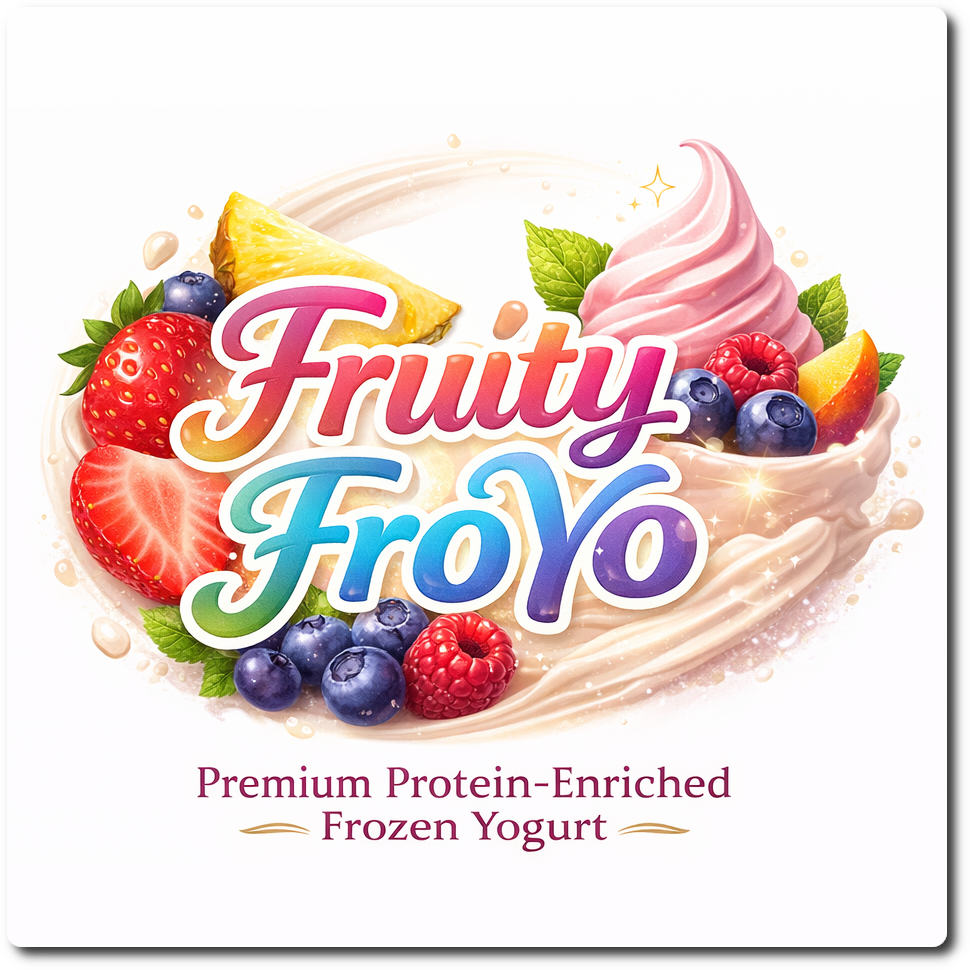
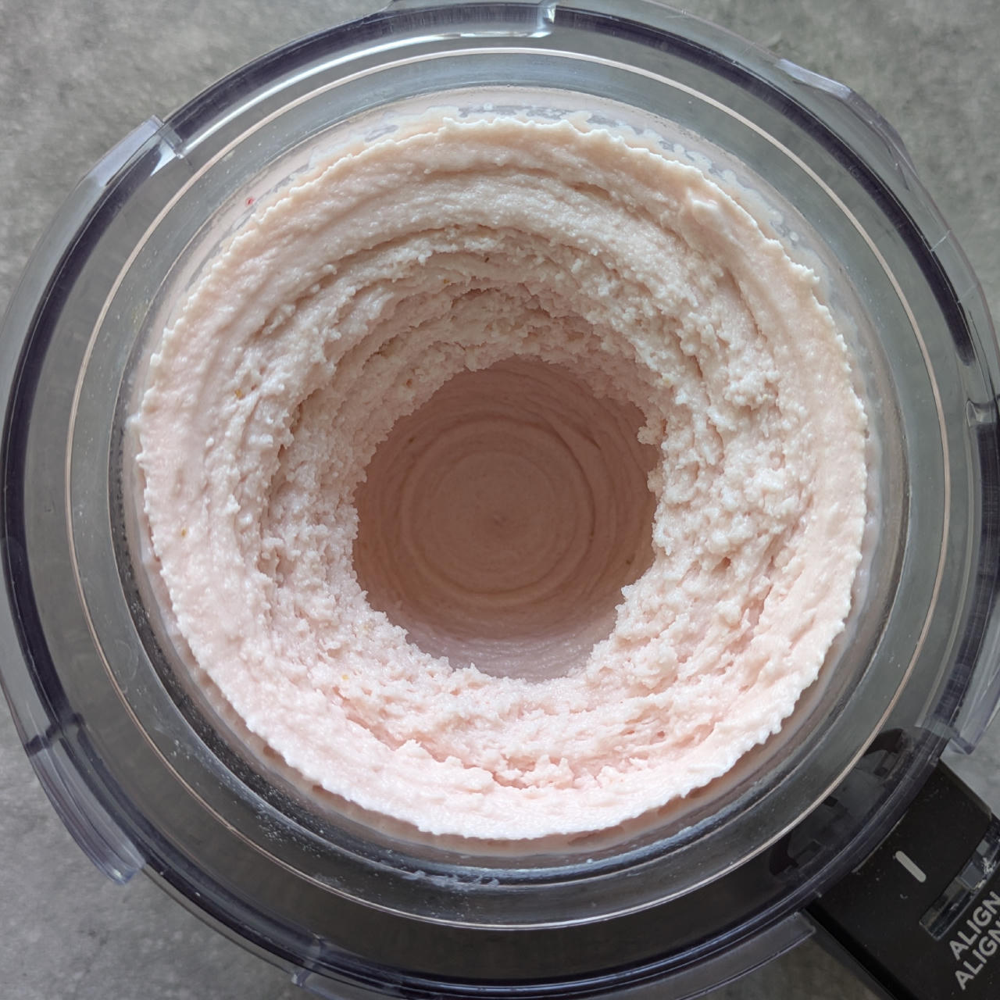
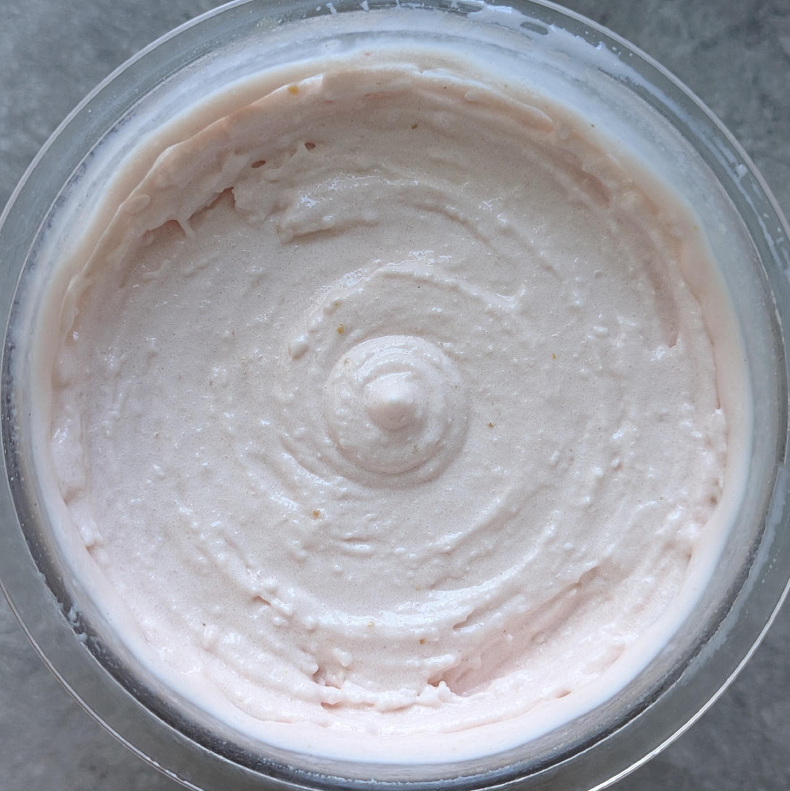
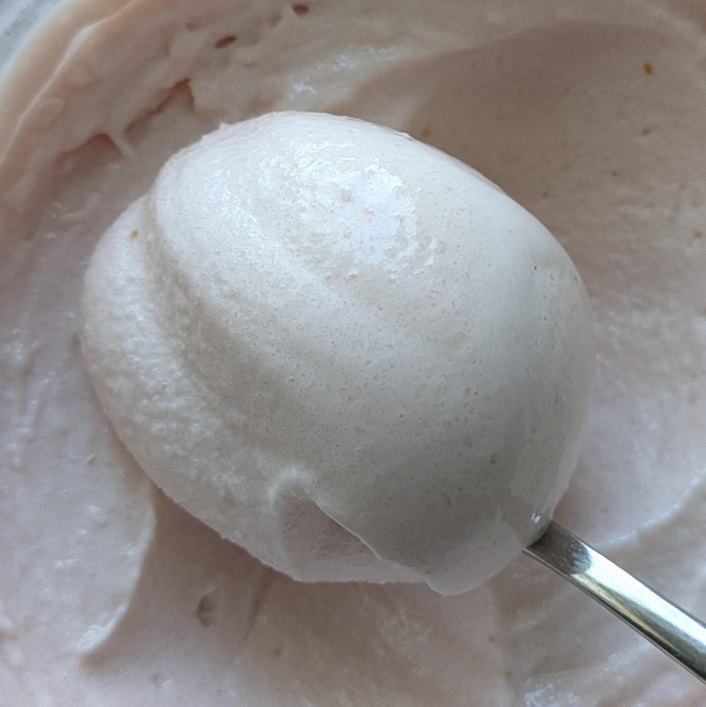

# Fruity FroYo (Deluxe)

*Fruity FroYo* is a light, protein‑enriched frozen yogurt
made from creamy 3.5% yogurt, and fresh or frozen fruit.
Rounded out with gentle sweetness and balanced
stabilizers for a smooth, scoopable texture.

Spun on “Light Ice Cream”, scrape down, and “Ice Cream”.

> 
> 
> 

Rating: 😋🥛🍒🍓🫐 (primarily tangy yogurt, with the fruit in the background)

# INGREDIENTS

ℹ️ Brand names are in square brackets `[...]`.

**Wet**

  - _500g_ Yogurt 3.5% [REWE]
  - _100g_ Strawberries • fresh or frozen [31kcal, 6g sugar]
  - _15g_ [Glycerin (E422, VG) \[hd-line\]](/ice-creamery/info/ingredients/#vegetable-glycerin-glycerol-vg-e422){target="_blank"}↗ • POD = 60%; GI = 5; Density = 1.26 g/ml
  - _10g_ [Brandy or Vodka 40 vol%](/ice-creamery/info/ingredients/#alcohol-ethanol){target="_blank"}↗ • *alternative:* 8g (additional) VG for a sober recipe

**Dry**

  - _35g_ [SweEX (Erythritol + Xylitol 3:2)](/ice-creamery/info/ingredients/#sweex-erythritol-xylitol-blend){target="_blank"}↗ • *alternative:* 47g allulose or dextrose
  - _10g_ [Skim milk powder 1:10 (SMP) \[Vita2You\]](/ice-creamery/info/ingredients/#skim-milk-powder-smp){target="_blank"}↗
  - _10g_ [Whey + Casein protein (grass-fed) \[Vilgain\]](/ice-creamery/info/ingredients/#whey-protein){target="_blank"}↗ • with stevia
  - _10g_ [Salty Stability \[Inulin / GMS / CMC / Guar / XG / Salt\]](/ice-creamery/S/Salty%20Stability/){target="_blank"}↗ • *not-as-good substitute:* 1g guar, 0.3g xanthan, and 0.3g salt

**Fill to MAX**

  - _≈4 drops_ Flavor drops Vanilla (sucralose) [IronMaxx] • to taste

**Optional / Choices**

  - _100g_ Strawberries • fresh or frozen [31kcal, 6g sugar]
  - _100g_ Blueberries • fresh or frozen [48kcal, 9g sugar]
  - _100g_ Kiwi • fresh [52kcal, 9g sugar]
  - _100g_ Cherries • fresh or frozen [61kcal, 10g sugar]
  - _100g_ Mango • fresh or frozen [62kcal, 13g sugar]
  - _100g_ Pineapple in juice [Del Monte] • canned [68kcal, 15g sugar]

# DIRECTIONS

 1. Add "wet" ingredients to empty Creami tub.
 1. Weigh and mix dry ingredients, easiest by adding to a jar with a secure lid and shaking vigorously.
 1. Pour into the tub and *QUICKLY* use an immersion blender on full speed to homogenize everything.
 1. Let blender run until thickeners are properly hydrated, up to 1-2 min. Or blend again after waiting that time.
 1. Add remaining ingredients (to the MAX line) and stir with a spoon.
 1. For better results, let the base age in the fridge (covered, lid on), for a few hours or over night. This helps flavor development and gum hydration, especially with unheated bases.
 1. Freeze for 24h with lid on, then spin as usual. Flatten any humps before that.
 1. Process with RE-SPIN mode when not creamy enough after the first spin.

# NUTRITIONAL & OTHER INFO

- **Nutritional values per 100g/ml:** 100g; 88.2 kcal; fat 2.7g; carbs 13.6g; sugar 5.2g; protein 5.3g; salt 0.2g
- **Nutritional values per ½ Deluxe Tub:** 340g; 299.7 kcal; fat 9.3g; carbs 46.4g; sugar 17.7g; protein 17.9g; salt 0.6g
- **Nutritional values total:** 690g; 608.3 kcal; fat 18.8g; carbs 94.1g; sugar 35.9g; protein 36.3g; salt 1.3g
- **FPDF / [PAC](/ice-creamery/info/glossary/#potere-anti-congelante-pac){target="_blank"}↗ (target 20..30):** 31.59
- **Protein / Energy Ratio (ok=12%; hi=20%):** 23.89% • LOW-FAT • Hi-Protein
- **Milk Solids Non-Fat ([MSNF](/ice-creamery/info/glossary/#milk-solids-not-fat-msnf){target="_blank"}↗, 7-11%):** 72.6g • 10.5%
- **Net carbs:** 44.2g • *∝ 5 servings@138g:* 8.8g • *∝ 3 servings@230g:* 14.7g • *energy ratio (low <20%):* 29.1%
- **10g 'Salty Stability' is:** 7.3g Inulin • 1.2g Glycerol Monostearate (GMS / E471) • 0.6g Tylose powder (E466, Tylo, CMC) • 0.4g Guar gum (E412) • 0.33g Salt • 0.13g Xanthan gum (E415, XG).
