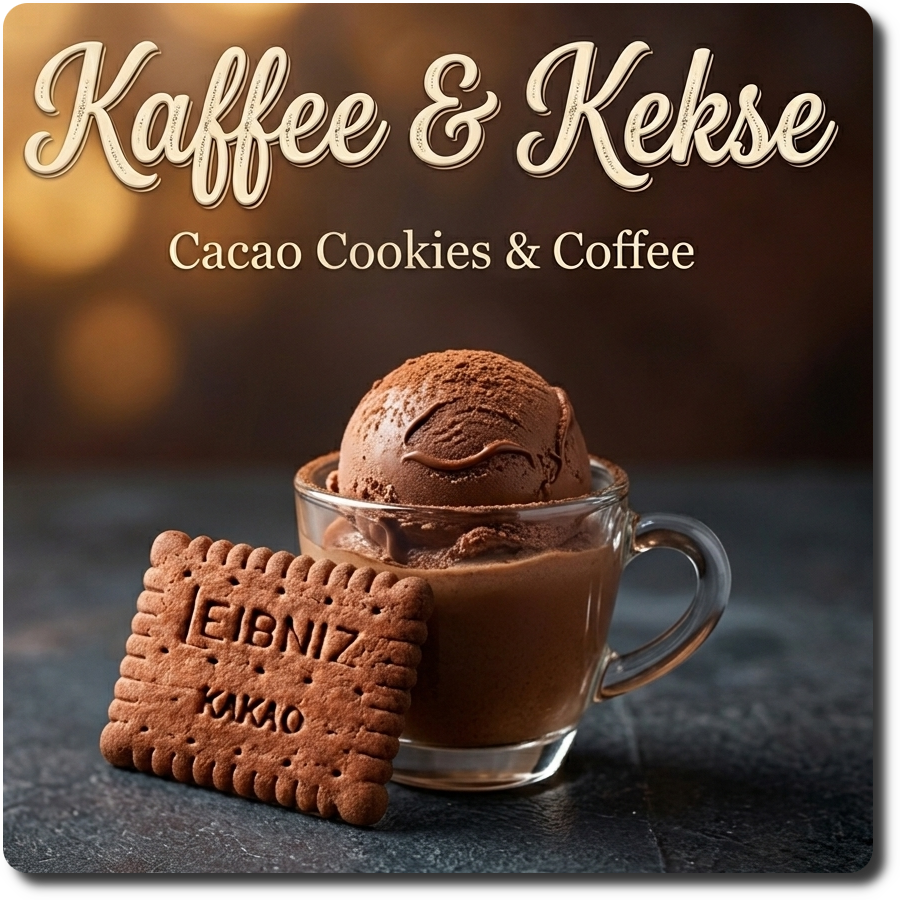

# Kaffee & Kekse (Deluxe)

The name is a wordplay on the German “Kaffee & Kuchen” (coffee & cake),
a time-honored tradition of meeting to enjoy some java and sweet treats.
But we use cacao cookies here (use *Oreo thins* if you cannot get *Leibniz Kekse*).

Spun on Sorbet, followed by a scrape-down and the mix-in.

> 
> 
> 

*Rating:* 😋☕🍪 (untested)

# INGREDIENTS

ℹ️ Brand names are in square brackets `[...]`.

**Wet**

  - _325ml_ Extra strong coffee (≈1 cup + 3 fl oz)
  - _100ml_ [Soy milk 1.6% (sugar-free) \[Berief\]](/ice-creamery/info/ingredients/#soy-milk){target="_blank"}↗ (≈3 fl oz + 2 ¼ tsp) • *alternative*: any other preferred milk (~2% fat) <a id="id-2755284" href="https://jhermann.github.io/ice-creamery/info/nutrition/#id-2755284">ℹ️</a>
  - _100g_ [Cottage Cheese 4% \[REWE Bio\]](/ice-creamery/info/ingredients/#cottage-cheese){target="_blank"}↗ (≈3 oz + 1 tbsp) • *alternative:* 30g cream cheese and 70ml milk <a id="id-c6c5c25" href="https://jhermann.github.io/ice-creamery/info/nutrition/#id-c6c5c25">ℹ️</a>
  - _15g_ [Glycerin (E422, VG) \[hd-line\]](/ice-creamery/info/ingredients/#vegetable-glycerin-glycerol-vg-e422){target="_blank"}↗ (≈1 tbsp) • Sweetness = 60%; GI = 5; Density = 1.26 g/ml <a id="id-8717e6d" href="https://jhermann.github.io/ice-creamery/info/nutrition/#id-8717e6d">ℹ️</a>
  - _15g_ [Brandy or Vodka 40 vol%](/ice-creamery/info/ingredients/#alcohol-ethanol){target="_blank"}↗ (≈1 tbsp) • *alternative:* 12g (additional) VG for a sober recipe <a id="id-63b8bf1" href="https://jhermann.github.io/ice-creamery/info/nutrition/#id-63b8bf1">ℹ️</a>
  - _21g_ [❔Coffee Liqueur 25 vol% \[Caffè Borghetti\]](/ice-creamery/info/ingredients/#alcohol-ethanol){target="_blank"}↗ (≈1 tbsp + 1 ¼ tsp) • if you have it, *instead of* the brandy/vodka

**Dry**

  - _40g_ [SweEX (Erythritol + Xylitol 3:2)](/ice-creamery/info/ingredients/#sweex-erythritol-xylitol-blend){target="_blank"}↗ (≈1 oz + 2 ¼ tsp) • *alternative:* 53g allulose or dextrose <a id="id-f44b101" href="https://jhermann.github.io/ice-creamery/info/nutrition/#id-f44b101">ℹ️</a>
  - _15g_ [Salty Stability \[Inulin / GMS / CMC / Guar / XG / Salt\]](/ice-creamery/S/Salty%20Stability/){target="_blank"}↗ (≈1 tbsp) • *not-as-good substitute:* 1.5g guar, 0.5g xanthan, and 0.5g salt <a id="id-3d1ecef" href="https://jhermann.github.io/ice-creamery/info/nutrition/#id-3d1ecef">ℹ️</a>
  - _15g_ [Whey + Casein protein (grass-fed) \[Vilgain\]](/ice-creamery/info/ingredients/#whey-protein){target="_blank"}↗ (≈1 tbsp) • with stevia <a id="id-b954be3" href="https://jhermann.github.io/ice-creamery/info/nutrition/#id-b954be3">ℹ️</a>
  - _15g_ [Skim milk powder 1:10 (SMP) \[Vita2You\]](/ice-creamery/info/ingredients/#skim-milk-powder-smp){target="_blank"}↗ (≈1 tbsp)
  - _10g_ ❔Instant Coffee [Mount Hagen] (≈2 tsp) • *optional*, for a stronger coffee taste; 1.5g per 125ml
  - _10g_ [❔Cocoa Powder Organic 11% \[Sevenhills\]](/ice-creamery/info/ingredients/#cocoa-powder){target="_blank"}↗ (≈2 tsp) <a id="id-051a105" href="https://jhermann.github.io/ice-creamery/info/nutrition/#id-051a105">ℹ️</a>

**Fill to MAX**

  - _30ml_ Cream 32% [REWE Beste Wahl] (≈2 tbsp) <a id="id-92fa780" href="https://jhermann.github.io/ice-creamery/info/nutrition/#id-92fa780">ℹ️</a>
  - _≈3 drops_ Flavor drops Vanilla (sucralose) [IronMaxx] • to taste <a id="id-7c57f43" href="https://jhermann.github.io/ice-creamery/info/nutrition/#id-7c57f43">ℹ️</a>
  - _≈3 drops_ Flavor drops Cookies&Cream (stevia) [Nick’s] • to taste <a id="id-8fe5ede" href="https://jhermann.github.io/ice-creamery/info/nutrition/#id-8fe5ede">ℹ️</a>

**Mix-ins**

  - _20g_ Shortbread, Cacao (Kakaokeks) [Leibniz] (≈1 tbsp + 1 tsp) • 1pc ≈ 5g; 'Prescraped’ German Oreo thins 🙂 <a id="id-keks-cco" href="https://jhermann.github.io/ice-creamery/info/nutrition/#id-keks-cco">ℹ️</a>

# DIRECTIONS

 1. Add "wet" ingredients to empty Creami tub.
 1. Weigh and mix dry ingredients, easiest by adding to a jar with a secure lid and shaking vigorously.
 1. Pour into the tub and *QUICKLY* use an immersion blender on full speed to homogenize everything.
 1. Let blender run until thickeners are properly hydrated, up to 1-2 min. Or blend again after waiting that time.
 1. Add remaining ingredients (to the MAX line) and stir with a spoon.
 1. For better results, let the base age in the fridge (covered, lid on), for a few hours or over night. This helps flavor development and gum hydration, especially with unheated bases.
 1. Freeze for 24h with lid on, then spin as usual. Flatten any humps before that.
 1. Process with RE-SPIN mode when not creamy enough after the first spin.
 1. Process with MIX-IN after adding mix-ins evenly. For that, add partial amounts into a hole going down to the bottom, and fold the ice cream over, building pockets of mix-ins.

# NUTRITIONAL & OTHER INFO

| 🥗 Value | 100g | Serving | Total |
| :--- | ---: | ---: | ---: |
| ⚖️ Weight (g) | 100 | 340 | 700 |
| 🔥 Energy (kcal) | 91.6 | 311.4 | 641.1 |
| 🫒 Fat (g) | 3.0 | 10.2 | 21.1 |
| 🍞 Carbohydrates (g) | 13.7 | 46.6 | 95.9 |
| 🍬 Sugars (g) | 2.3 | 7.9 | 16.3 |
| 💪 Protein (g) | 5.4 | 18.4 | 37.9 |
| 🧂 Salt (g) | 0.2 | 0.8 | 1.7 |

- **FPDF / [PAC](/ice-creamery/info/glossary/#potere-anti-congelante-pac){target="_blank"}↗ (target 20..30):** 30.77
- **Protein / Energy Ratio (ok=12%; hi=20%):** 23.66% • Low-Sugar • Hi-Protein
- **Milk Solids Non-Fat ([MSNF](/ice-creamery/info/glossary/#milk-solids-not-fat-msnf){target="_blank"}↗, 7-11%):** 49.6g • 7.1%
- **Net carbs:** 37.3g • *∝ 5 servings@140g:* 7.5g • *∝ 3 servings@233g:* 12.4g • *energy ratio (low <20%):* 23.3%
- **15g 'Salty Stability' is:** 11.0g Inulin • 1.8g Glycerol Monostearate (GMS / E471) • 0.9g Tylose powder (E466, Tylo, CMC) • 0.6g Guar gum (E412) • 0.5g Salt • 0.2g Xanthan gum (E415, XG).
