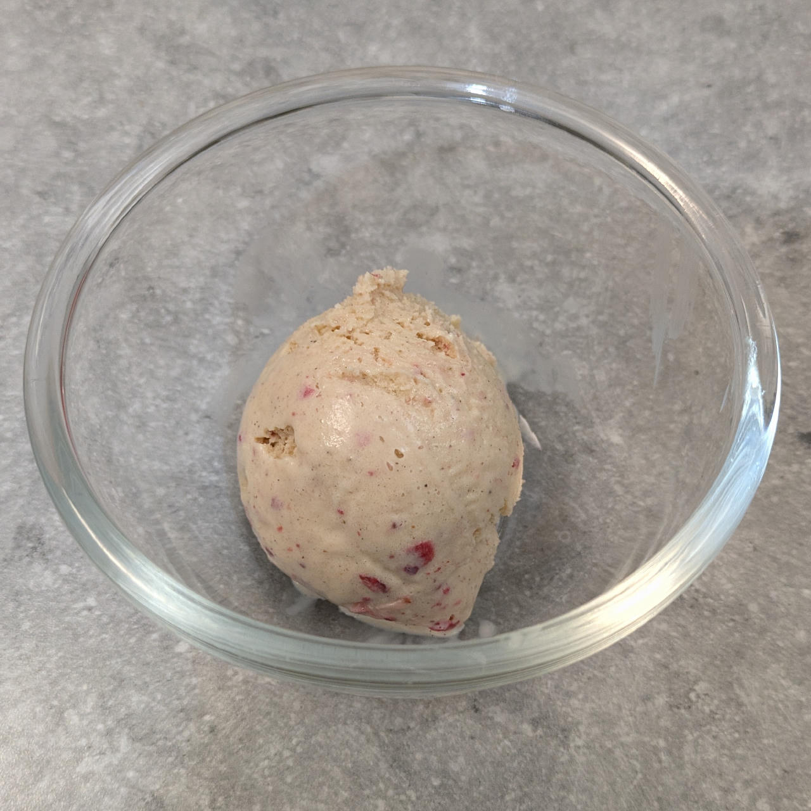

# Locarb Vanilla (Deluxe)

This high-protein vanilla ice cream base is designed for a smooth, creamy texture with minimal sugar.

The blend of low-carb soy milk and cottage cheese makes the recipe have a rich mouthfeel similar to traditional gelato but with optimized macros.
The inclusion of stabilizers and a small amount of alcohol helps to suppress the freezing point, ensuring your treat remains scoopable rather than icy.

Spin on “Light Ice Cream”, scrape down, and re-mix if needed.

> 

Rating: 😋🍦🍦🍦🍓 (freeze-dried strawberries as a mix-in; nice vanilla flavor with a fruity chew)



# INGREDIENTS

ℹ️ Brand names are in square brackets `[...]`.

**Wet**

  - _300ml_ [Soy milk 1.6% (sugar-free) \[Berief\]](/ice-creamery/info/ingredients/#soy-milk){target="_blank"}↗ (≈1 cup + 2 fl oz) • *alternative:* any other locarb milk (~2% fat) <a id="id-2755284" href="https://jhermann.github.io/ice-creamery/info/nutrition/#id-2755284">ℹ️</a>
  - _200g_ [Cottage Cheese 4% \[REWE Bio\]](/ice-creamery/info/ingredients/#cottage-cheese){target="_blank"}↗ (≈7 oz) • *alternative:* 60g cream cheese and 140ml milk <a id="id-c6c5c25" href="https://jhermann.github.io/ice-creamery/info/nutrition/#id-c6c5c25">ℹ️</a>
  - _10g_ [Glycerin (E422, VG) \[hd-line\]](/ice-creamery/info/ingredients/#vegetable-glycerin-glycerol-vg-e422){target="_blank"}↗ (≈2 tsp) <a id="id-8717e6d" href="https://jhermann.github.io/ice-creamery/info/nutrition/#id-8717e6d">ℹ️</a>
  - _10g_ [Brandy or Vodka 40 vol%](/ice-creamery/info/ingredients/#alcohol-ethanol){target="_blank"}↗ (≈2 tsp) • *alternative:* 8g (additional) VG for a sober recipe <a id="id-63b8bf1" href="https://jhermann.github.io/ice-creamery/info/nutrition/#id-63b8bf1">ℹ️</a>
  - _5ml_ Vanilla Extract (w/ alcohol) [Native Vanilla] (≈1 tsp) <a id="id-92d1980" href="https://jhermann.github.io/ice-creamery/info/nutrition/#id-92d1980">ℹ️</a>

**Dry**

  - _42g_ [SweEX (Erythritol + Xylitol 3:2)](/ice-creamery/info/ingredients/#sweex-erythritol-xylitol-blend){target="_blank"}↗ (≈1 oz + 2 ¾ tsp) • *alternative:* 56g allulose or dextrose <a id="id-f44b101" href="https://jhermann.github.io/ice-creamery/info/nutrition/#id-f44b101">ℹ️</a>
  - _40g_ [Whey + Casein protein (grass-fed) \[Vilgain\]](/ice-creamery/info/ingredients/#whey-protein){target="_blank"}↗ (≈1 oz + 2 ¼ tsp) • with stevia <a id="id-b954be3" href="https://jhermann.github.io/ice-creamery/info/nutrition/#id-b954be3">ℹ️</a>
  - _15g_ [Inulin \[Vit4ever\]](/ice-creamery/info/ingredients/#inulin){target="_blank"}↗ (≈1 tbsp) • Sweetness = 8%; GI ~= 0 <a id="id-d8bc1db" href="https://jhermann.github.io/ice-creamery/info/nutrition/#id-d8bc1db">ℹ️</a>
  - _10g_ [Salty Stability \[Inulin / GMS / CMC / Guar / XG / Salt\]](/ice-creamery/S/Salty%20Stability/){target="_blank"}↗ (≈2 tsp) • *not-as-good substitute:* 1g guar, 0.3g xanthan, and 0.3g salt <a id="id-3d1ecef" href="https://jhermann.github.io/ice-creamery/info/nutrition/#id-3d1ecef">ℹ️</a>
  - _2g_ Vanilla Bean Powder [InterVanilla] (≈½ tsp) <a id="id-538e9f6" href="https://jhermann.github.io/ice-creamery/info/nutrition/#id-538e9f6">ℹ️</a>

**Fill to MAX**

  - _40ml_ Cream 32% [REWE Beste Wahl] (≈1 fl oz + 2 tsp) <a id="id-92fa780" href="https://jhermann.github.io/ice-creamery/info/nutrition/#id-92fa780">ℹ️</a>
  - _≈5 drops_ Flavor drops Vanilla (sucralose) [IronMaxx] • to taste

**Mix-ins**

  - _15g_ Strawberry slices freeze-dried [EWL] (≈1 tbsp) • add as a mix-in [45kcal, 7.2g sugar] <a id="id-25f7a44" href="https://jhermann.github.io/ice-creamery/info/nutrition/#id-25f7a44">ℹ️</a>

**Topping Options**

  - _15g_ Jam “Black Cherry” [Schwartau Extra Zero] (≈1 tbsp) • fruit spread, no added sugar; add as a topping [9kcal, 1.1g sugar] <a id="id-5b5d02b" href="https://jhermann.github.io/ice-creamery/info/nutrition/#id-5b5d02b">ℹ️</a>
  - _15g_ Jam “Strawberry” [Schwartau Extra Zero] (≈1 tbsp) • fruit spread, no added sugar; add as a topping [8kcal, 0.5g sugar] <a id="id-004dcfc" href="https://jhermann.github.io/ice-creamery/info/nutrition/#id-004dcfc">ℹ️</a>
  - _15g_ Jam “Apricot” [Schwartau Extra Zero] (≈1 tbsp) • fruit spread, no added sugar; add as a topping [8kcal, 0.6g sugar] <a id="id-sw0z-acot" href="https://jhermann.github.io/ice-creamery/info/nutrition/#id-sw0z-acot">ℹ️</a>

# DIRECTIONS

 1. Add "wet" ingredients to empty Creami tub.
 1. Weigh and mix dry ingredients, easiest by adding to a jar with a secure lid and shaking vigorously.
 1. Pour into the tub and *QUICKLY* use an immersion blender on full speed to homogenize everything.
 1. Let blender run until thickeners are properly hydrated, up to 1-2 min. Or blend again after waiting that time.
 1. Add remaining ingredients (to the MAX line) and stir with a spoon.
 1. For better results, let the base age in the fridge (covered, lid on), for a few hours or over night. This helps flavor development and gum hydration, especially with unheated bases.
 1. Freeze for 24h with lid on, then spin as usual. Flatten any humps before that.
 1. Process with RE-SPIN mode when not creamy enough after the first spin.
 1. Process with MIX-IN after adding mix-ins evenly. For that, add partial amounts into a hole going down to the bottom, and fold the ice cream over, building pockets of mix-ins.

# NUTRITIONAL & OTHER INFO

| 🥗 Value | 100g | Serving | Total |
| :--- | ---: | ---: | ---: |
| ⚖️ Weight (g) | 100 | 340 | 674 |
| 🔥 Energy (kcal) | 110.2 | 374.8 | 743.0 |
| 🫒 Fat (g) | 4.1 | 14.0 | 27.8 |
| 🍞 Carbohydrates (g) | 12.4 | 42.3 | 83.8 |
| 🍬 Sugars (g) | 1.1 | 3.8 | 7.6 |
| 💪 Protein (g) | 10.0 | 34.0 | 67.4 |
| 🧂 Salt (g) | 0.3 | 1.1 | 2.3 |

- **FPDF / [PAC](/ice-creamery/info/glossary/#potere-anti-congelante-pac){target="_blank"}↗ (target 20..30):** 30.55
- **Protein / Energy Ratio (ok=12%; hi=20%):** 36.30% • Low-Sugar • Hi-Protein
- **Milk Solids Non-Fat ([MSNF](/ice-creamery/info/glossary/#milk-solids-not-fat-msnf){target="_blank"}↗, 7-11%):** 82.7g • 12.3%
- **Net carbs:** 16.1g • 2.4% • *∝ 5 servings@135g:* 3.2g • *∝ 3 servings@225g:* 5.4g • *energy ratio (low <20%):* 8.7%
- **10g 'Salty Stability' is:** 7.3g Inulin • 1.2g Glycerol Monostearate (GMS / E471) • 0.6g Tylose powder (E466, Tylo, CMC) • 0.4g Guar gum (E412) • 0.33g Salt • 0.13g Xanthan gum (E415, XG).
