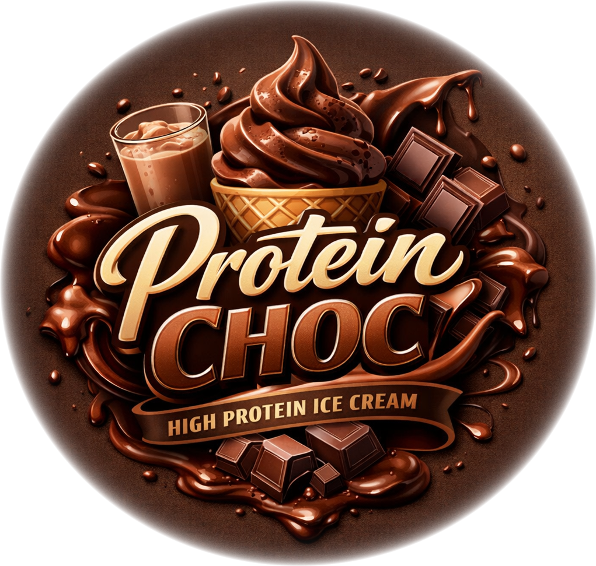

# Protein Choc (Deluxe)

Chocolate ice cream, very high in protein.
You can boost the chocolate flavor by using chocolate milk,
and adding dark chocolate as a mix-in or by melting it into the bloomed cocoa.

Spin on “Light Ice Cream”, scrape down, and run a mix-in cycle.

> 
> 
> 

Rating: 😋🥛🍫 (untested)

# INGREDIENTS

ℹ️ Brand names are in square brackets `[...]`.

**Prep**

  - _150ml_ [Soy milk 1.6% (sugar-free) \[Berief\]](/ice-creamery/info/ingredients/#soy-milk){target="_blank"}↗ • *alternative:* any other preferred milk (~2% fat)
  - _45g_ [Cocoa Powder Organic 11% \[Sevenhills\]](/ice-creamery/info/ingredients/#cocoa-powder){target="_blank"}↗
  - _45g_ [SweEX (Erythritol + Xylitol 3:2)](/ice-creamery/info/ingredients/#sweex-erythritol-xylitol-blend){target="_blank"}↗ • *alternative:* 60g allulose or dextrose

**Wet**

  - _300ml_ [Soy milk 1.6% (sugar-free) \[Berief\]](/ice-creamery/info/ingredients/#soy-milk){target="_blank"}↗ • *alternative:* any other preferred milk (~2% fat)
  - _20g_ [Glycerin (E422, VG) \[hd-line\]](/ice-creamery/info/ingredients/#vegetable-glycerin-glycerol-vg-e422){target="_blank"}↗ • *alternative:* 16g (additional) VG for a sober recipe
  - _15g_ [Brandy or Vodka 40 vol%](/ice-creamery/info/ingredients/#alcohol-ethanol){target="_blank"}↗ • *alternative:* same amount additional VG for a sober recipe

**Dry**

  - _50g_ [Whey protein Chocolate \[MaxiNutrition\]](/ice-creamery/info/ingredients/#whey-protein){target="_blank"}↗
  - _15g_ [Salty Stability \[Inulin / GMS / CMC / Guar / XG / Salt\]](/ice-creamery/S/Salty%20Stability/){target="_blank"}↗ • *not-as-good substitute:* 1.5g guar, 0.5g xanthan, and 0.5g salt

**Fill to MAX**

  - _40ml_ Cream 32% [REWE Beste Wahl]
  - _≈6 drops_ Flavor drops Vanilla (sucralose) [IronMaxx] • to taste

**Mix-ins**

  - _30g_ [Milk Choc. w/ Nougat \[frankonia\]](/ice-creamery/info/ingredients/#soy-milk){target="_blank"}↗ • no extra sugar; frozen & broken into chunks [152kcal, 3g sugar]

# DIRECTIONS

 1. Mix the cocoa and sweetener with milk heatened in the microwave (to >80°C), blend to a smooth paste.
 1. Add the bloomed cocoa and the other wet ingredients to an empty Creami tub.
 1. Weigh and mix dry ingredients, easiest by adding to a jar with a secure lid and shaking vigorously.
 1. Pour into the tub and *QUICKLY* use an immersion blender on full speed to homogenize everything.
 1. Let blender run until thickeners are properly hydrated, up to 1-2 min. Or blend again after waiting that time.
 1. Add remaining ingredients (to the MAX line) and stir with a spoon.
 1. For better results, let the base age in the fridge (covered, lid on), for a few hours or over night. This helps flavor development and gum hydration, especially with unheated bases.
 1. Freeze for 24h with lid on, then spin as usual. Flatten any humps before that.
 1. Process with RE-SPIN mode when not creamy enough after the first spin.
 1. Process with MIX-IN after adding mix-ins evenly. For that, add partial amounts into a hole going down to the bottom, and fold the ice cream over, building pockets of mix-ins.

# NUTRITIONAL & OTHER INFO

- **Nutritional values per 100g/ml:** 100g; 121.0 kcal; fat 4.1g; carbs 14.4g; sugar 0.6g; protein 9.5g; salt 0.2g
- **Nutritional values per ½ Deluxe Tub:** 340g; 411.5 kcal; fat 14.0g; carbs 49.1g; sugar 2.1g; protein 32.3g; salt 0.6g
- **Nutritional values total:** 680g; 823.0 kcal; fat 27.9g; carbs 98.1g; sugar 4.3g; protein 64.6g; salt 1.2g
- **FPDF / [PAC](/ice-creamery/info/glossary/#potere-anti-congelante-pac){target="_blank"}↗ (target 20..30):** 30.03
- **Protein / Energy Ratio (ok=12%; hi=20%):** 31.42% • Low-Sugar • Hi-Protein
- **Milk Solids Non-Fat ([MSNF](/ice-creamery/info/glossary/#milk-solids-not-fat-msnf){target="_blank"}↗, 7-11%):** 64.3g • 9.5%
- **Net carbs:** 32.0g • *∝ 5 servings@136g:* 6.4g • *∝ 3 servings@227g:* 10.7g • *energy ratio (low <20%):* 15.6%
- **15g 'Salty Stability' is:** 11.0g Inulin • 1.8g Glycerol Monostearate (GMS / E471) • 0.9g Tylose powder (E466, Tylo, CMC) • 0.6g Guar gum (E412) • 0.5g Salt • 0.2g Xanthan gum (E415, XG).
