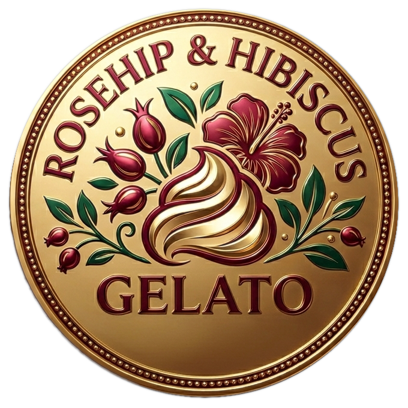
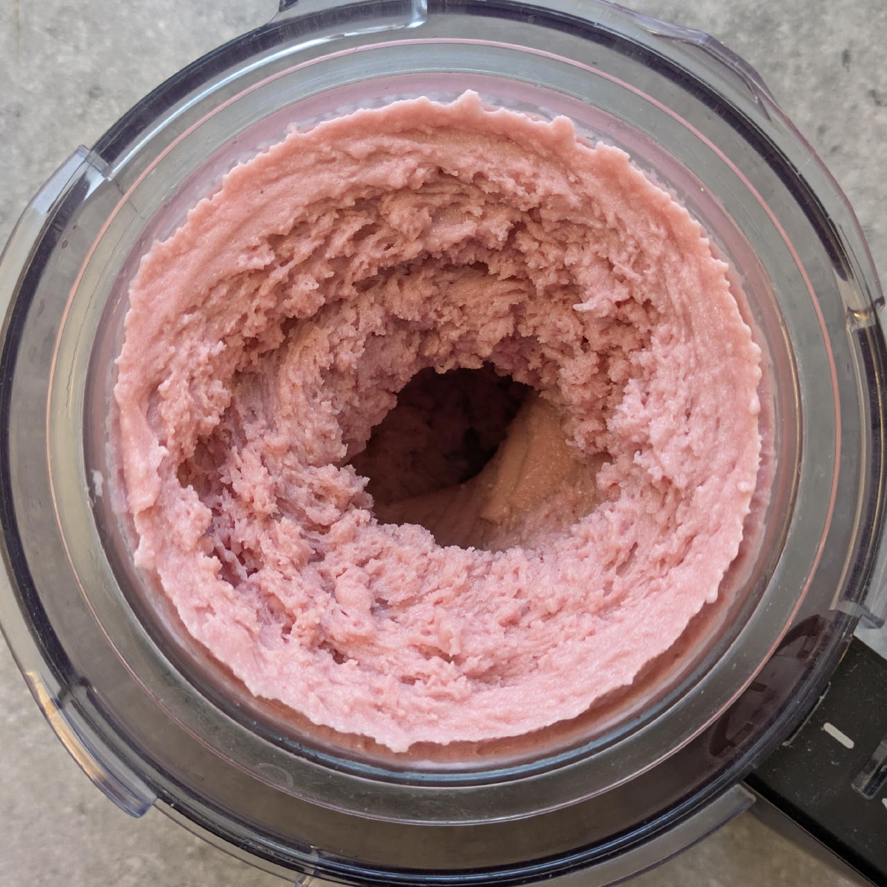
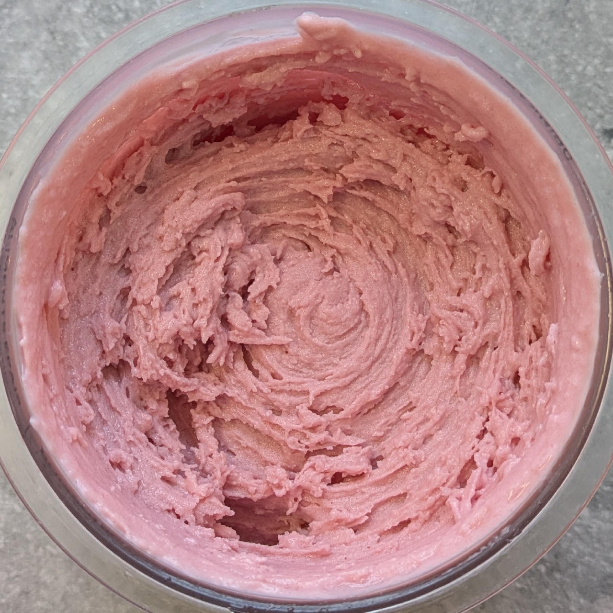
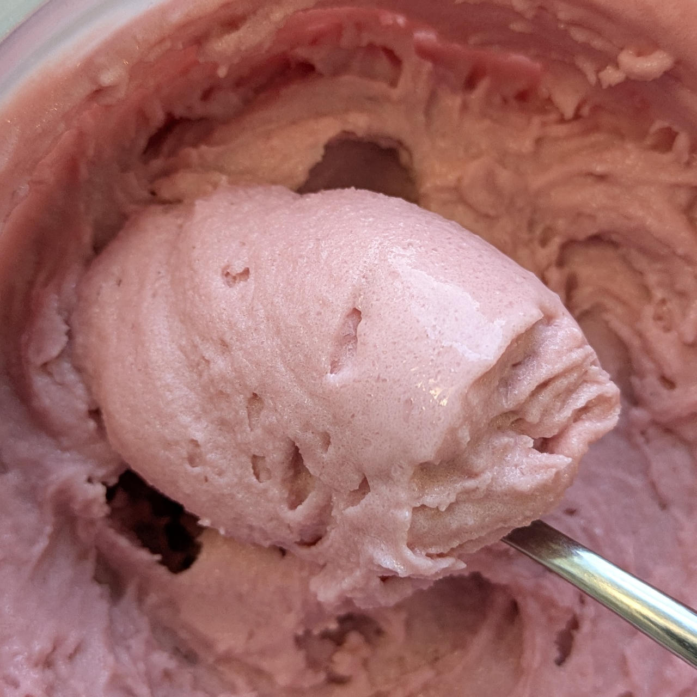

# Rosehip & Hibiscus (Deluxe)

If you’re looking for a refreshing, floral treat that skips the heavy cream and sugar, this *Rosehip & Hibiscus Gelato* is for you.

By combining a concentrated cold-brew tea base with technical ingredients like inulin and xanthan gum, you get a texture like store-bought, without the high fat content.

> 🌿 **Vegan & Dairy-free**

You can of course try this with any other type of tea you like, adapt the number of tea bags depending on its intensity.

!!! note "Sober Recipe"

    If you prefer a non-alcoholic version, simply swap the Grappa for an extra 8g of Vegetable Glycerin (VG) to maintain that soft consistency.

Spin on “Sorbet”, scrape down, and re-mix.

> 
> 
> 

*Rating:* 😋🌹🌹🌺🍵 (subtle and sweet)

!!! note "Why These Ingredients Work"

    The combination of *Waxy Maize Starch* and *Xanthan Gum* provides a thick & velvety body, while *Glycerin* and a touch of *Grappa* lower the freezing point to keep the gelato soft and scoopable.

    By using a blend of *Erythritol, Xylitol, and Inulin*, you get a balanced & low-glycemic sweetness.

# INGREDIENTS

ℹ️ Brand names are in square brackets `[...]`.

**Prep**

  - _575ml_ [Soy milk 1.6% (sugar-free) \[Berief\]](/ice-creamery/info/ingredients/#soy-milk){target="_blank"}↗ (≈2 cups + 3 fl oz) • *alternative:* any other preferred milk (~2% fat) <a id="id-2755284" href="https://jhermann.github.io/ice-creamery/info/nutrition/#id-2755284">ℹ️</a>
  - _2 bags_ Tea (Rosehip & Hibiscus)

**Wet**

  - _17g_ [Glycerin (E422, VG) \[hd-line\]](/ice-creamery/info/ingredients/#vegetable-glycerin-glycerol-vg-e422){target="_blank"}↗ (≈1 tbsp + ½ tsp) <a id="id-8717e6d" href="https://jhermann.github.io/ice-creamery/info/nutrition/#id-8717e6d">ℹ️</a>
  - _10g_ Grappa 40 vol% [Sibona] (≈2 tsp) • *alternative:* 8g (additional) VG for a sober recipe <a id="id-bd27e02" href="https://jhermann.github.io/ice-creamery/info/nutrition/#id-bd27e02">ℹ️</a>

**Dry**

  - _45g_ [SweEX (Erythritol + Xylitol 3:2)](/ice-creamery/info/ingredients/#sweex-erythritol-xylitol-blend){target="_blank"}↗ (≈3 tbsp) • *alternative:* 60g allulose or dextrose <a id="id-f44b101" href="https://jhermann.github.io/ice-creamery/info/nutrition/#id-f44b101">ℹ️</a>
  - _15g_ [Inulin \[Vit4ever\]](/ice-creamery/info/ingredients/#inulin){target="_blank"}↗ (≈1 tbsp) • Sweetness = 8%; GI ~= 0 <a id="id-d8bc1db" href="https://jhermann.github.io/ice-creamery/info/nutrition/#id-d8bc1db">ℹ️</a>
  - _15g_ [Waxy Maize Starch (E1442) \[Ultratex\]](/ice-creamery/info/ingredients/#waxy-maize-starch-e1442){target="_blank"}↗ (≈1 tbsp) • dissolves easily; use 1-5% <a id="id-0e5caff" href="https://jhermann.github.io/ice-creamery/info/nutrition/#id-0e5caff">ℹ️</a>
  - _1g_ Citric Acid (≈¼ tsp) • 0.5–1g ≈ 15ml lemon juice <a id="id-42c46ba" href="https://jhermann.github.io/ice-creamery/info/nutrition/#id-42c46ba">ℹ️</a>
  - _1g_ [Xanthan gum (E415, XG)](/ice-creamery/info/ingredients/#xanthan-gum-xg-e415){target="_blank"}↗ (≈¼ tsp) • 1tsp ≈ 2.8g <a id="id-5236903" href="https://jhermann.github.io/ice-creamery/info/nutrition/#id-5236903">ℹ️</a>
  - _2g_ Beet Root Powder (organic) [Mandoi] (≈½ tsp) • *optional*, for color <a id="id-72d8998" href="https://jhermann.github.io/ice-creamery/info/nutrition/#id-72d8998">ℹ️</a>

**Adjust sweetness**

  - _≈6 drops_ Flavor drops “Natural” (stevia) [Nick’s] • to taste • unflavored
  - _≈6 drops_ Flavor drops Vanilla (sucralose) [IronMaxx] • to taste

# DIRECTIONS

 1. Steep the tea in the milk, for a few hours or over night in the fridge.
 1. Add "wet" ingredients and the tea to empty Creami tub.
 1. Weigh and mix dry ingredients, easiest by adding to a jar with a secure lid and shaking vigorously.
 1. Pour into the tub and *QUICKLY* use an immersion blender on full speed to homogenize everything.
 1. Let blender run until thickeners are properly hydrated, up to 1-2 min. Or blend again after waiting that time.
 1. Add remaining ingredients and stir with a spoon.
 1. For better results, let the base age in the fridge (covered, lid on), for a few hours or over night. This helps flavor development and gum hydration, especially with unheated bases.
 1. Freeze for 24h with lid on, then spin as usual. Flatten any humps before that.
 1. Process with RE-SPIN mode when not creamy enough after the first spin.

# NUTRITIONAL & OTHER INFO

| 🥗 Value | 100g | Serving | Total |
| :--- | ---: | ---: | ---: |
| ⚖️ Weight (g) | 100 | 340 | 683 |
| 🔥 Energy (kcal) | 61.1 | 207.6 | 417.0 |
| 🫒 Fat (g) | 1.4 | 4.6 | 9.2 |
| 🍞 Carbohydrates (g) | 14.6 | 49.5 | 99.4 |
| 🍬 Sugars (g) | 0.3 | 1.1 | 2.3 |
| 💪 Protein (g) | 2.6 | 8.8 | 17.7 |
| 🧂 Salt (g) | 0.1 | 0.3 | 0.6 |

- **FPDF / [PAC](/ice-creamery/info/glossary/#potere-anti-congelante-pac){target="_blank"}↗ (target 20..30):** 31.13
- **Protein / Energy Ratio (ok=12%; hi=20%):** 16.95% • LOW-FAT • Low-Sugar • Low-Salt
- **Milk Solids Non-Fat ([MSNF](/ice-creamery/info/glossary/#milk-solids-not-fat-msnf){target="_blank"}↗, 7-11%):** 23.0g • 3.4%
- **Net carbs:** 32.5g • *∝ 5 servings@137g:* 6.5g • *∝ 3 servings@228g:* 10.8g • *energy ratio (low <20%):* 31.2%
