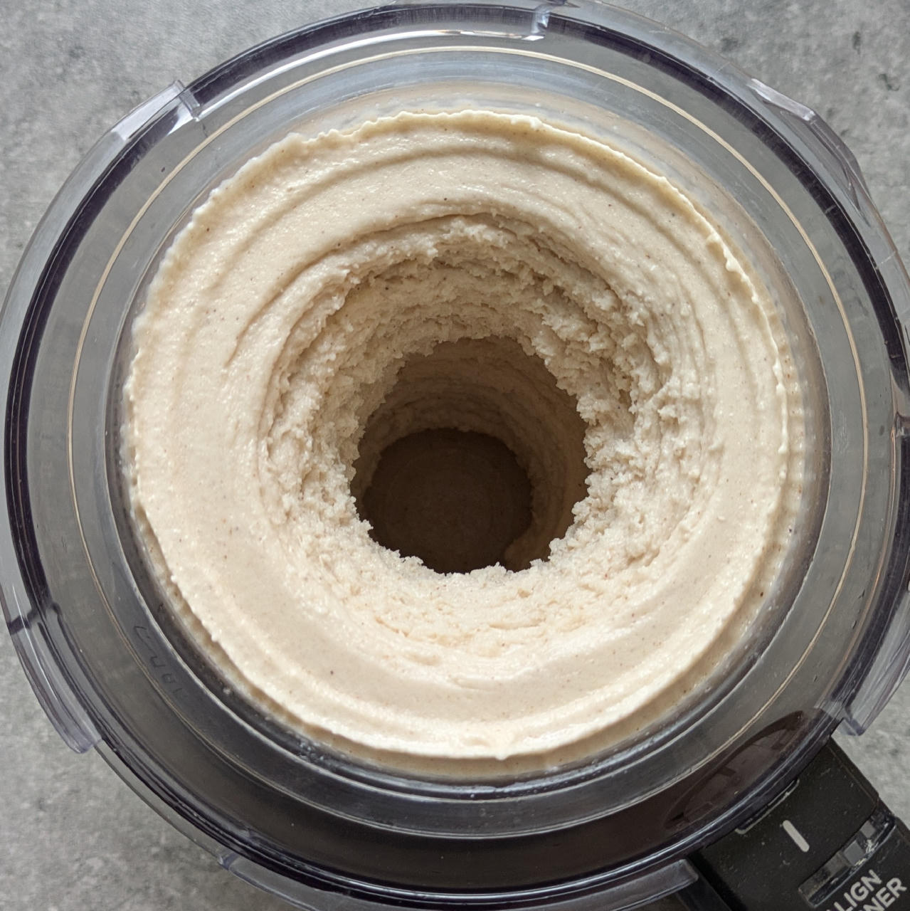
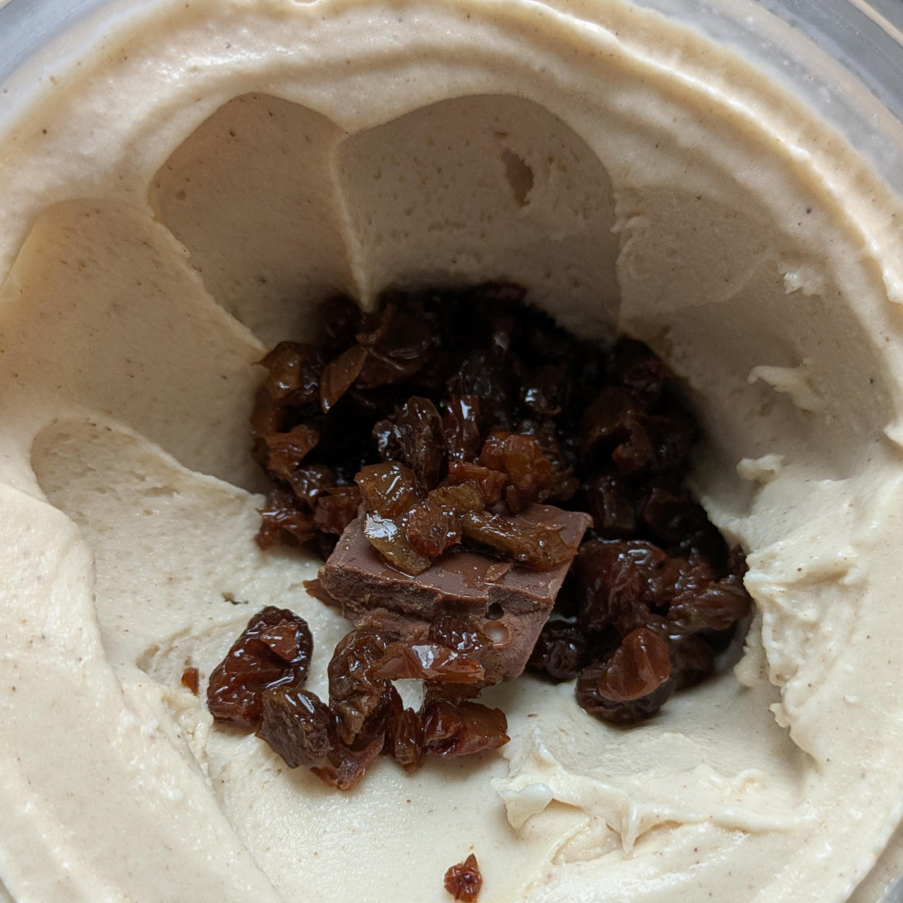
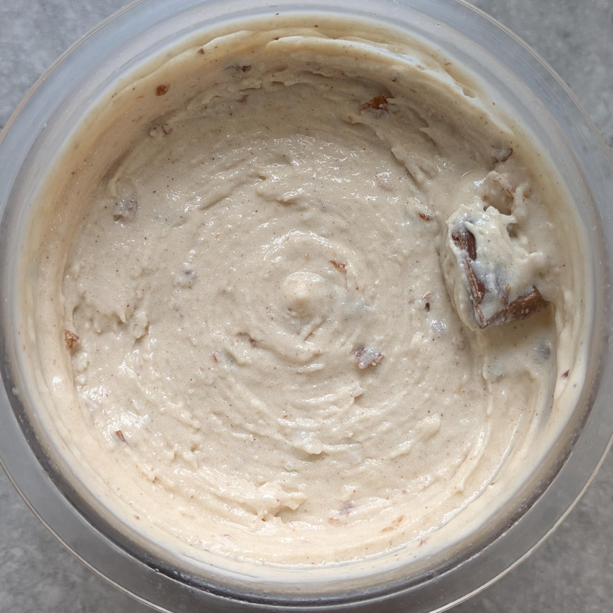
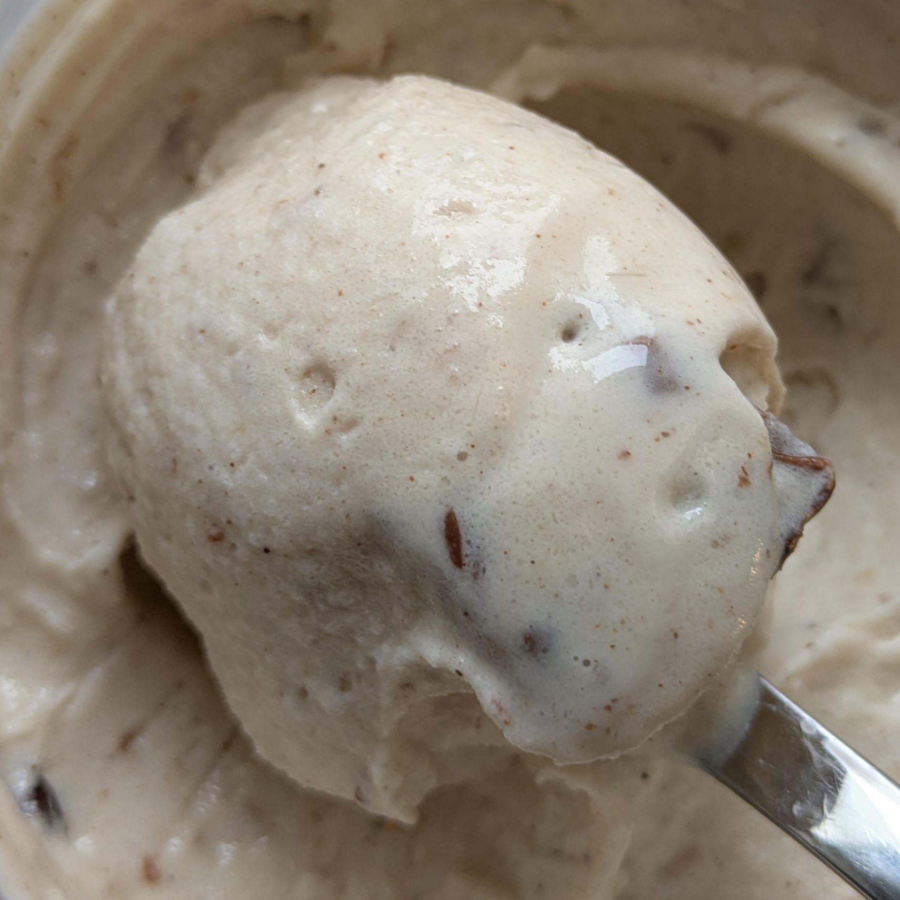

# Rum Raisin Coconut (Deluxe)

This rum raisin coconut ice cream combines the deep flavor
of rum-soaked raisins with the smooth richness of coconut milk.
The result is a creamy, balanced ice cream that’s lightly tropical with a warm hint of rum.

Don’t forget to soak the raisins at least a day before preparing the base.
Macros include the mix-ins. 

Process on *Light Ice Cream*, do a scrape-down, followed by the mix-in run.

> 
> 
> 
> 

Rating: 😋🍹🍇🥥🥥 (soft & creamy, no ice crystals)

# INGREDIENTS

ℹ️ Brand names are in square brackets `[...]`.

**Prep**

  - _100ml_ Water (~85°C) • *alternative:* 150ml coconut milk 18.5%
  - _50g_ [Coconut Milk Powder 54% \[Green Essence\]](/ice-creamery/info/ingredients/#coconut-milk){target="_blank"}↗
  - _0.90g_ [Glycerol Monostearate (E471) \[Bulk\]](/ice-creamery/info/ingredients/#glycerol-monostearate-gms-e471){target="_blank"}↗ • *alternative:* lecithin

**Wet**

  - _375ml_ [Soy milk 1.6% (sugar-free) \[Berief\]](/ice-creamery/info/ingredients/#soy-milk){target="_blank"}↗ • *alternative*: any other preferred milk (~2% fat)

**Dry**

  - _30g_ [SweEX (Erythritol + Xylitol 3:2)](/ice-creamery/info/ingredients/#sweex-erythritol-xylitol-blend){target="_blank"}↗ • *alternative:* 40g allulose or dextrose
  - _15g_ [Salty Stability \[Inulin / GMS / CMC / Guar / XG / Salt\]](/ice-creamery/S/Salty%20Stability/){target="_blank"}↗ • *not-as-good substitute:* 1.5g guar, 0.5g xanthan, and 0.5g salt
  - _15g_ [Whey + Casein protein (grass-fed) \[Vilgain\]](/ice-creamery/info/ingredients/#whey-protein){target="_blank"}↗ • with stevia
  - _1.5g_ Cinnamon (Ceylon) • to taste; 1tsp = 3g

**Adjust sweetness**

  - _≈5 drops_ Flavor drops Vanilla (sucralose) [IronMaxx] • to taste

**Mix-ins**

  - _40g_ Sultanas (organic) [Biojoy] • chopped, soaked in rum [119kcal, 27g sugar]
  - _45g_ [Jamaica Rum 43 vol%](/ice-creamery/info/ingredients/#alcohol-ethanol){target="_blank"}↗ • drain raisins and add surplus to base

# DIRECTIONS

 1. At least one day before making the base, chop the raisins and cover with the rum in a small container with lid, put into the fridge.
 1. For the base, mix the coconut milk powder and the GMS in a medium-sized bowl.
 1. Add the hot water and whisk until clump-free.
 1. Add "wet" ingredients to empty Creami tub, including the prepared coconut milk and the surplus rum from soaking.
 1. Weigh and mix dry ingredients, easiest by adding to a jar with a secure lid and shaking vigorously.
 1. Pour into the tub and *QUICKLY* use an immersion blender on full speed to homogenize everything.
 1. Let blender run until thickeners are properly hydrated, up to 1-2 min. Or blend again after waiting that time.
 1. Add remaining ingredients and stir with a spoon.
 1. For better results, let the base age in the fridge (covered, lid on), for a few hours or over night. This helps flavor development and gum hydration, especially with unheated bases.
 1. Freeze for 24h with lid on, then spin as usual. Flatten any humps before that.
 1. Process with RE-SPIN mode when not creamy enough after the first spin.
 1. Process with MIX-IN after adding mix-ins evenly. For that, add partial amounts into a hole going down to the bottom, and fold the ice cream over, building pockets of mix-ins.

# NUTRITIONAL & OTHER INFO

- **Nutritional values per 100g/ml:** 100g; 122.1 kcal; fat 5.2g; carbs 14.1g; sugar 4.3g; protein 4.1g; salt 0.1g
- **Nutritional values per ½ Deluxe Tub:** 340g; 415.2 kcal; fat 17.7g; carbs 47.9g; sugar 14.7g; protein 13.9g; salt 0.5g
- **Nutritional values total:** 672g; 821.0 kcal; fat 35.0g; carbs 94.8g; sugar 29.1g; protein 27.4g; salt 1.0g
- **FPDF / [PAC](/ice-creamery/info/glossary/#potere-anti-congelante-pac){target="_blank"}↗ (target 20..30):** 30.71
- **Protein / Energy Ratio (ok=12%; hi=20%):** 13.36% • Low-Sugar
- **Milk Solids Non-Fat ([MSNF](/ice-creamery/info/glossary/#milk-solids-not-fat-msnf){target="_blank"}↗, 7-11%):** 51.8g • 7.7%
- **Net carbs:** 53.8g • *∝ 5 servings@134g:* 10.8g • *∝ 3 servings@224g:* 17.9g • *energy ratio (low <20%):* 26.2%
- **15g 'Salty Stability' is:** 11.0g Inulin • 1.8g Glycerol Monostearate (GMS / E471) • 0.9g Tylose powder (E466, Tylo, CMC) • 0.6g Guar gum (E412) • 0.5g Salt • 0.2g Xanthan gum (E415, XG).
