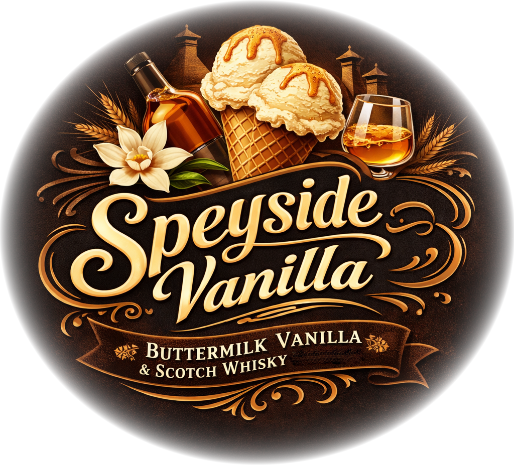

# Speyside Vanilla (Deluxe)

Based on “Buttermilk Vanilla”, with an infusion of Scotch spirit.

Change the vanilla flavoring to what you have, e.g. vanilla paste or essence. Just be sure to use enough, and taste the base.

Process on *Light Ice Cream*, with scrape-down, and a mix-in or respin run if needed. 

> 
> 
> 

Rating: 😋🥛🍦 (untested)

# INGREDIENTS

ℹ️ Brand names are in square brackets `[...]`.

**Wet**

  - _500ml_ Buttermilk 1% [REWE] • *alternative:* Milk zero fat / hi-protein [“Fairlife”]
  - _45g_ Speyside Scotch Whisky 40 vol% • for example “Glenlivet 12”
  - _6ml_ Vanilla Extract (w/ alcohol) [Native Vanilla]

**Dry**

  - _15g_ [SweEX (Erythritol + Xylitol 3:2)](/ice-creamery/info/ingredients/#sweex-erythritol-xylitol-blend){target="_blank"}↗ • *alternative:* 20g allulose or dextrose
  - _15g_ [Whey + Casein protein (grass-fed) \[Vilgain\]](/ice-creamery/info/ingredients/#whey-protein){target="_blank"}↗ • with stevia
  - _15g_ [Waxy Maize Starch (E1442) \[Ultratex\]](/ice-creamery/info/ingredients/#waxy-maize-starch-e1442){target="_blank"}↗ • *alternative:* [E1422](https://jhermann.github.io/ice-creamery/info/ingredients/#acetylated-distarch-adipate-e1422) / *any* modified starch
  - _3g_ Vanilla Bean Powder [InterVanilla]
  - _1g_ Salt
  - _6 pcs_ Sweetener Tablets [LightSüß] • 1 tablet ≃ 4g sugar

**Fill to MAX**

  - _80ml_ Cream 32% [REWE Beste Wahl]
  - _≈3 drops_ Flavor drops Vanilla (sucralose) [IronMaxx] • to taste

**Topping Options**

  - _15g_ Walnuts (organic) [Biojoy] • add as a mix-in or topping [101kcal, 1g sugar]
  - _15g_ Pecan nuts (organic) [Biojoy] • add as a mix-in or topping [108kcal, 0.6g sugar]

# DIRECTIONS

 1. Add "wet" ingredients to empty Creami tub.
 1. Weigh and mix dry ingredients, easiest by adding to a jar with a secure lid and shaking vigorously.
 1. Pour into the tub and *QUICKLY* use an immersion blender on full speed to homogenize everything.
 1. Let blender run until thickeners are properly hydrated, up to 1-2 min. Or blend again after waiting that time.
 1. Add remaining ingredients (to the MAX line) and stir with a spoon.
 1. For better results, let the base age in the fridge (covered, lid on), for a few hours or over night. This helps flavor development and gum hydration, especially with unheated bases.
 1. Freeze for 24h with lid on, then spin as usual. Flatten any humps before that.
 1. Process with RE-SPIN mode when not creamy enough after the first spin.

# NUTRITIONAL & OTHER INFO

- **Nutritional values per 100g/ml:** 100g; 100.3 kcal; fat 4.2g; carbs 7.8g; sugar 3.5g; protein 4.6g; salt 0.3g
- **Nutritional values per ½ Deluxe Tub:** 340g; 341.1 kcal; fat 14.4g; carbs 26.7g; sugar 11.9g; protein 15.8g; salt 1.0g
- **Nutritional values total:** 680g; 682.1 kcal; fat 28.8g; carbs 53.4g; sugar 23.8g; protein 31.6g; salt 2.0g
- **FPDF / [PAC](/ice-creamery/info/glossary/#potere-anti-congelante-pac){target="_blank"}↗ (target 20..30):** 33.24
- **Protein / Energy Ratio (ok=12%; hi=20%):** 18.52% • Low-Sugar
- **Milk Solids Non-Fat ([MSNF](/ice-creamery/info/glossary/#milk-solids-not-fat-msnf){target="_blank"}↗, 7-11%):** 61.1g • 9.0%
- **Net carbs:** 38.4g • *∝ 5 servings@136g:* 7.7g • *∝ 3 servings@227g:* 12.8g • *energy ratio (low <20%):* 22.5%
