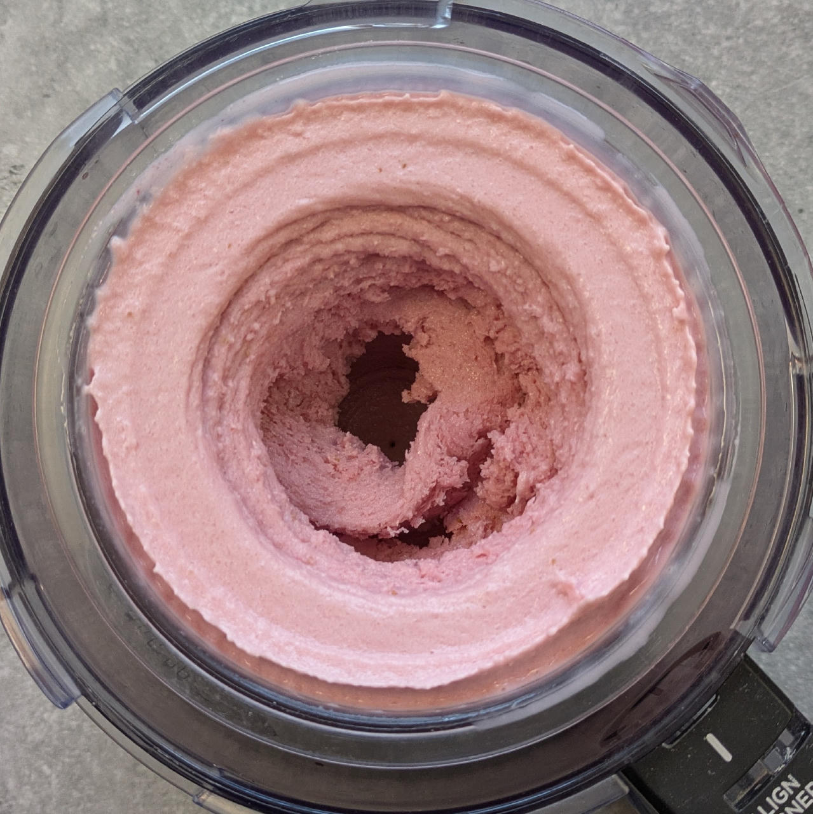
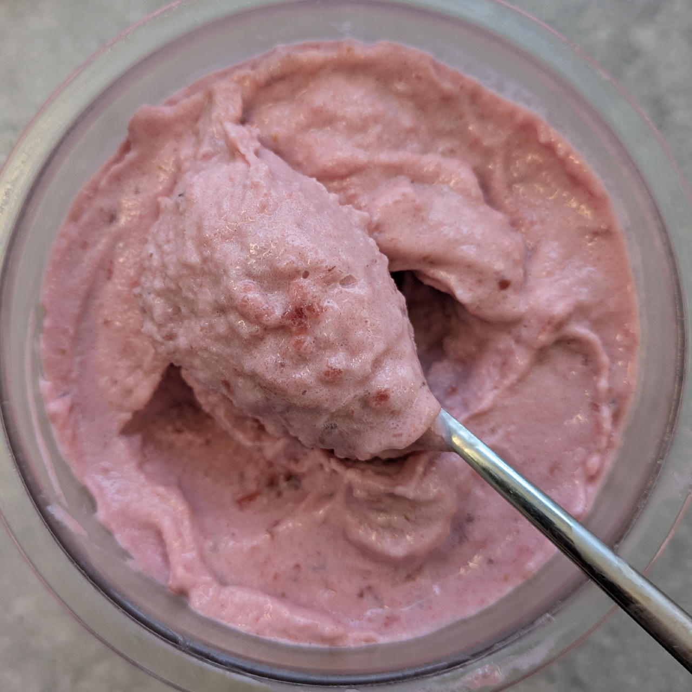

# Strawberry Ice Cream (Deluxe)

This *Strawberry Ice Cream* offers a premium texture using a high-protein formula.
By combining fresh strawberries with stabilizers
and a touch of alcohol, this recipe achieves a brightly flavored and exceptionally creamy,
crystal-free result, even after refreezing.
> 

Process on Lite Ice Cream directly from the freezer,
fill the hole with crumbled dried strawberry slices,
and work them in via a mix-in run.

Intense flavor, very creamy, dense and free of ice crystals,
with a nice crunch from the mix-in.

Rating: 😋😋😋🍓🍓

> 
> 

# INGREDIENTS

ℹ️ Brand names are in square brackets `[...]`.

**Wet**

  - _300ml_ [Soy milk 1.6% (sugar-free) \[Berief\]](/ice-creamery/info/ingredients/#soy-milk){target="_blank"}↗ (≈1 cup + 2 fl oz) • *alternative*: any other preferred milk (~2% fat) <a id="id-2755284" href="https://jhermann.github.io/ice-creamery/info/nutrition/#id-2755284">ℹ️</a>
  - _225g_ Strawberries (≈7 oz + 1 tbsp + 2 ½ tsp) <a id="id-93f3a24" href="https://jhermann.github.io/ice-creamery/info/nutrition/#id-93f3a24">ℹ️</a>
  - _50g_ [Cream Cheese 23% \[Exquisa\]](/ice-creamery/info/ingredients/#cream-cheese){target="_blank"}↗ (≈1 oz + 1 tbsp + 1 ½ tsp) • or 100g cottage cheese and less milk <a id="id-d6271a9" href="https://jhermann.github.io/ice-creamery/info/nutrition/#id-d6271a9">ℹ️</a>
  - _15g_ [Brandy or Vodka 40 vol%](/ice-creamery/info/ingredients/#alcohol-ethanol){target="_blank"}↗ (≈1 tbsp) • *alternative:* 12g (additional) VG for a sober recipe <a id="id-63b8bf1" href="https://jhermann.github.io/ice-creamery/info/nutrition/#id-63b8bf1">ℹ️</a>
  - _15g_ [Glycerin (E422, VG) \[hd-line\]](/ice-creamery/info/ingredients/#vegetable-glycerin-glycerol-vg-e422){target="_blank"}↗ (≈1 tbsp) • POD = 60%; GI = 5; Density = 1.26 g/ml <a id="id-8717e6d" href="https://jhermann.github.io/ice-creamery/info/nutrition/#id-8717e6d">ℹ️</a>

**Dry**

  - _35g_ [SweEX (Erythritol + Xylitol 3:2)](/ice-creamery/info/ingredients/#sweex-erythritol-xylitol-blend){target="_blank"}↗ (≈1 oz + 1 ¼ tsp) • *alternative:* 47g allulose or dextrose <a id="id-f44b101" href="https://jhermann.github.io/ice-creamery/info/nutrition/#id-f44b101">ℹ️</a>
  - _20g_ [Whey + Casein protein (grass-fed) \[Vilgain\]](/ice-creamery/info/ingredients/#whey-protein){target="_blank"}↗ (≈1 tbsp + 1 tsp) <a id="id-b954be3" href="https://jhermann.github.io/ice-creamery/info/nutrition/#id-b954be3">ℹ️</a>
  - _15g_ [Salty Stability \[Inulin / GMS / CMC / Guar / XG / Salt\]](/ice-creamery/S/Salty%20Stability/){target="_blank"}↗ (≈1 tbsp) • *not-as-good substitute:* 1.5g guar, 0.5g xanthan, and 0.5g salt <a id="id-3d1ecef" href="https://jhermann.github.io/ice-creamery/info/nutrition/#id-3d1ecef">ℹ️</a>
  - _3g_ Designer Flavor Powder [ESN] (≈½ tsp) • *optional* flavor boost, “strawberry + white choc”, ≈70% inulin <a id="id-03e7b2f" href="https://jhermann.github.io/ice-creamery/info/nutrition/#id-03e7b2f">ℹ️</a>
  - _2g_ Beet Root Powder (organic) [Mandoi] (≈½ tsp) • *optional*, for color <a id="id-72d8998" href="https://jhermann.github.io/ice-creamery/info/nutrition/#id-72d8998">ℹ️</a>

**Adjust sweetness**

  - _≈4 drops_ Flavor drops Vanilla (sucralose) [IronMaxx] • to taste <a id="id-7c57f43" href="https://jhermann.github.io/ice-creamery/info/nutrition/#id-7c57f43">ℹ️</a>

**Mix-ins**

  - _15g_ Strawberry slices freeze-dried [EWL] (≈1 tbsp) • add crumbled as a mix-in [45kcal, 7g sugar] <a id="id-25f7a44" href="https://jhermann.github.io/ice-creamery/info/nutrition/#id-25f7a44">ℹ️</a>

# DIRECTIONS

 1. Add "wet" ingredients to empty Creami tub.
 1. Weigh and mix dry ingredients, easiest by adding to a jar with a secure lid and shaking vigorously.
 1. Pour into the tub and *QUICKLY* use an immersion blender on full speed to homogenize everything.
 1. Let blender run until thickeners are properly hydrated, up to 1-2 min. Or blend again after waiting that time.
 1. Add remaining ingredients and stir with a spoon.
 1. For better results, let the base age in the fridge (covered, lid on), for a few hours or over night. This helps flavor development and gum hydration, especially with unheated bases.
 1. Freeze for 24h with lid on, then spin as usual. Flatten any humps before that.
 1. Process with RE-SPIN mode when not creamy enough after the first spin.
 1. Process with MIX-IN after adding mix-ins evenly. For that, add partial amounts into a hole going down to the bottom, and fold the ice cream over, building pockets of mix-ins.

# NUTRITIONAL & OTHER INFO

| 🥗 Value | 100g | Serving | Total |
| :--- | ---: | ---: | ---: |
| ⚖️ Weight (g) | 100 | 340 | 680 |
| 🔥 Energy (kcal) | 81.1 | 275.8 | 551.5 |
| 🫒 Fat (g) | 2.7 | 9.3 | 18.6 |
| 🍞 Carbohydrates (g) | 12.3 | 41.8 | 83.7 |
| 🍬 Sugars (g) | 2.6 | 8.9 | 17.8 |
| 💪 Protein (g) | 4.4 | 15.0 | 29.9 |
| 🧂 Salt (g) | 0.2 | 0.6 | 1.2 |

- **FPDF / [PAC](/ice-creamery/info/glossary/#potere-anti-congelante-pac){target="_blank"}↗ (target 20..30):** 31.41
- **Protein / Energy Ratio (ok=12%; hi=20%):** 21.71% • LOW-FAT • Low-Sugar • Hi-Protein
- **Milk Solids Non-Fat ([MSNF](/ice-creamery/info/glossary/#milk-solids-not-fat-msnf){target="_blank"}↗, 7-11%):** 34.9g • 5.1%
- **Net carbs:** 29.9g • *∝ 5 servings@136g:* 6g • *∝ 3 servings@227g:* 10g • *energy ratio (low <20%):* 21.7%
- **Nov 15, 2024:** Swap whey with SMP
- **Jun 21, 2025:** Switched to soy milk and protein
- **15g 'Salty Stability' is:** 11.0g Inulin • 1.8g Glycerol Monostearate (GMS / E471) • 0.9g Tylose powder (E466, Tylo, CMC) • 0.6g Guar gum (E412) • 0.5g Salt • 0.2g Xanthan gum (E415, XG).
