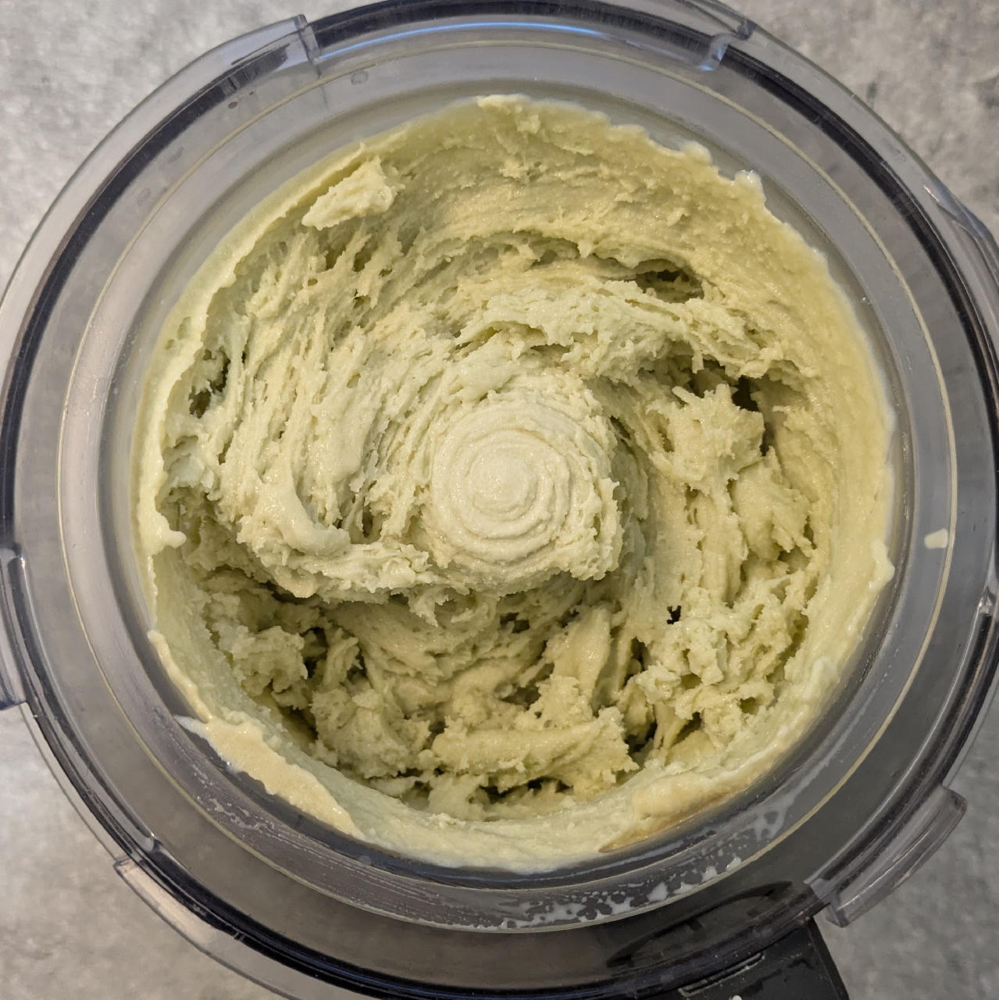
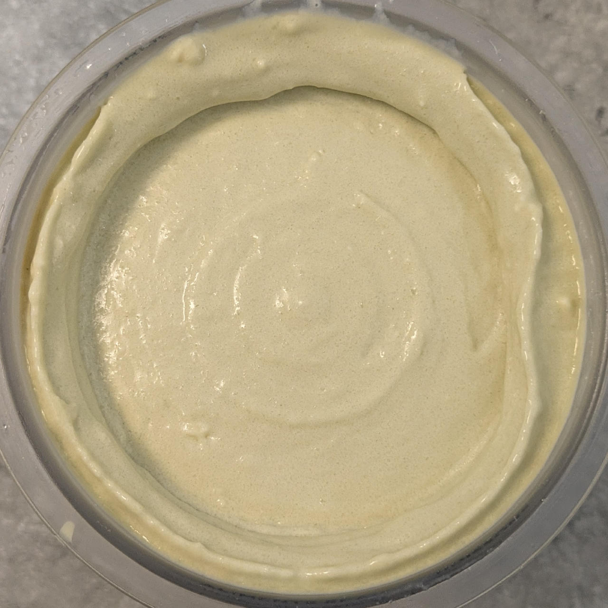
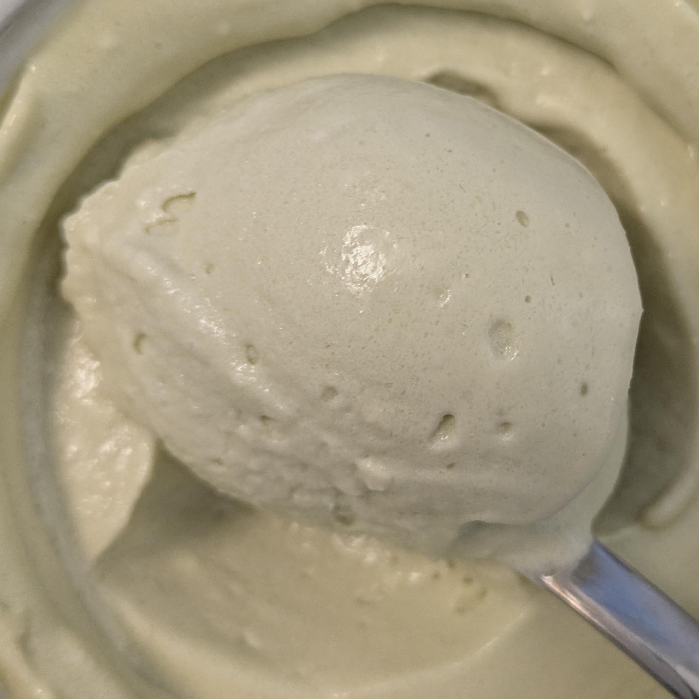

# Woodruff (Deluxe)

Woodruff flavor (or “Waldmeister”) is a rather German thing, used in the green version of *Berliner Kindl*,
in May punch (*Maibowle*), or as a flavor of *Ahoi Brause*.

This works using instant drink powder sticks for flavoring.
With this recipe, you can use any brand and flavor of instant drink powder you like though (e.g. IQMIX in the US),
as long as it is normally mixed into about 500ml of water.

The one I use is based on maltodextrin, and already contains a good amounts of sweetness,
so make sure to dial in any additional sweeteners to your palate.
While doing so, keep the freezing point depression in mind.

Spin on “Sorbet”, scrape down, and respin.

> 
> 
> 

Rating: 😋😋😋😋😋 (soft, creamy, sweet, woodruffian)

# INGREDIENTS

ℹ️ Brand names are in square brackets `[...]`.

**Wet**

  - _500ml_ [Soy milk 1.6% (sugar-free) \[Berief\]](/ice-creamery/info/ingredients/#soy-milk){target="_blank"}↗ • *alternative*: any other preferred milk (~2% fat)
  - _21g_ [Glycerin (E422, VG) \[hd-line\]](/ice-creamery/info/ingredients/#vegetable-glycerin-glycerol-vg-e422){target="_blank"}↗ • Sweetness = 60%; GI = 5; Density = 1.26 g/ml
  - _21g_ [Brandy or Vodka 40 vol%](/ice-creamery/info/ingredients/#alcohol-ethanol){target="_blank"}↗ • *alternative:* 17g (additional) VG for a sober recipe

**Dry**

  - _40g_ [Whey + Casein protein (grass-fed) \[Vilgain\]](/ice-creamery/info/ingredients/#whey-protein){target="_blank"}↗ • with stevia
  - _20g_ [SweEX (Erythritol + Xylitol 3:2)](/ice-creamery/info/ingredients/#sweex-erythritol-xylitol-blend){target="_blank"}↗ • *alternative:* 27g allulose or dextrose
  - _15g_ [Salty Stability \[Inulin / GMS / CMC / Guar / XG / Salt\]](/ice-creamery/S/Salty%20Stability/){target="_blank"}↗ • *not-as-good substitute:* 1.5g guar, 0.5g xanthan, and 0.5g salt
  - _5g_ Instant Drink “Woodruff” (0 sugar) [Instick] • 1 stick (2.5g) for 500ml water
  - _2g_ Matcha green tea powder (organic) [Mandoi] • for color; ½ tsp = 1g

**Fill to MAX**

  - _50ml_ [Soy milk 1.6% (sugar-free) \[Berief\]](/ice-creamery/info/ingredients/#soy-milk){target="_blank"}↗ • *alternative*: any other preferred milk (~2% fat)
  - _≈1 drops_ Flavor drops Vanilla (sucralose) [IronMaxx] • to taste

# DIRECTIONS

 1. Add "wet" ingredients to empty Creami tub.
 1. Weigh and mix dry ingredients, easiest by adding to a jar with a secure lid and shaking vigorously.
 1. Pour into the tub and *QUICKLY* use an immersion blender on full speed to homogenize everything.
 1. Let blender run until thickeners are properly hydrated, up to 1-2 min. Or blend again after waiting that time.
 1. Add remaining ingredients (to the MAX line) and stir with a spoon.
 1. For better results, let the base age in the fridge (covered, lid on), for a few hours or over night. This helps flavor development and gum hydration, especially with unheated bases.
 1. Freeze for 24h with lid on, then spin as usual. Flatten any humps before that.
 1. Process with RE-SPIN mode when not creamy enough after the first spin.

# NUTRITIONAL & OTHER INFO

- **Nutritional values per 100g/ml:** 100g; 81.6 kcal; fat 1.7g; carbs 10.0g; sugar 0.5g; protein 7.3g; salt 0.2g
- **Nutritional values per ½ Deluxe Tub:** 340g; 277.6 kcal; fat 5.7g; carbs 34.0g; sugar 1.8g; protein 24.8g; salt 0.6g
- **Nutritional values total:** 674g; 550.3 kcal; fat 11.3g; carbs 67.4g; sugar 3.5g; protein 49.1g; salt 1.2g
- **FPDF / [PAC](/ice-creamery/info/glossary/#potere-anti-congelante-pac){target="_blank"}↗ (target 20..30):** 30.78
- **Protein / Energy Ratio (ok=12%; hi=20%):** 35.72% • LOW-FAT • Low-Sugar • Hi-Protein
- **Milk Solids Non-Fat ([MSNF](/ice-creamery/info/glossary/#milk-solids-not-fat-msnf){target="_blank"}↗, 7-11%):** 58.2g • 8.6%
- **Net carbs:** 25.8g • *∝ 5 servings@135g:* 5.2g • *∝ 3 servings@225g:* 8.6g • *energy ratio (low <20%):* 18.8%
- **15g 'Salty Stability' is:** 11.0g Inulin • 1.8g Glycerol Monostearate (GMS / E471) • 0.9g Tylose powder (E466, Tylo, CMC) • 0.6g Guar gum (E412) • 0.5g Salt • 0.2g Xanthan gum (E415, XG).
